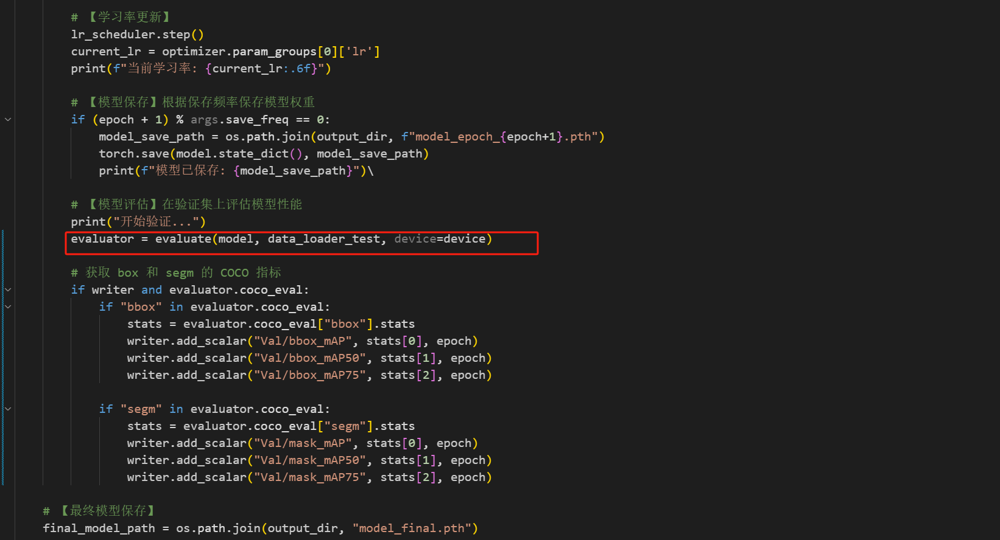
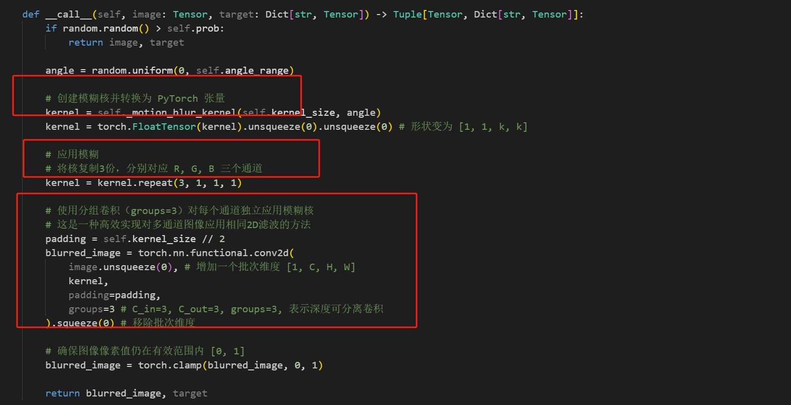

# 题目1 - 实验报告

 看到这个题目之后，我想了很多内容。这个是“基于神经网络的实例分割”，所以我必须首先构建神经网络，然后执行这个实例分割的任务。

 > 基于已有数据集或自制数据集，采用 PyTorch 或其他深度学习框架实现相应的神经网络搭建，进行模型训练，最终实现一个能够对 RGB 图像进行实例分割的算法。
 > 任务：实例分割
    1.实现一个基于神经网络的 RGB 图像实例分割算法；
    2.完成数据预处理模块（包括图像归一化、数据增强等）；
    3.设计或选择适当的网络架构进行实例分割的训练与预测；
    4.实现训练、验证、预测流程。

 我看到，最后的提示有：

 > 能够利用 pytorch 或其他深度学习框架构建主流的实例分割神经网络(如Mask R-CNN/YOLACT/SOLO 等)

 所以我们想先实现一个mask-r-cnn的神经网络，实现这个实例分割的算法。然后我们依照这个神经网络，再去决策下一步做的事情。

 首先我们看到，官方的mask-r-cnn网络是在Keras以及TensorFlow的，而之前我们接触的大多都是pytorch，并且题目也是推荐使用pytorch。然后我们看到，torchvision的官方文档中，有mask-r-cnn的实现，并且已经封装到vision库中，可以直接拿来调用。所以我们可以：

 1. 通过torchvision的调用，快速构建网络并且完成训练过程；
 2. 通过pytorch实现这个网络的全过程，包括数据加载、数据预处理、网络构建的全过程、训练、验证、预测等。

 这样，我们既可以简单、快速地进行训练，也可以从复现网络的全过程中，学习到更多的内容，以期待有改进的思路等。

 下面开始我们的实验进程。

## 1. Mask R-CNN流程

 我们查看mask r-cnn的论文，读取其中的关键部分，然后针对这个神经网络，对我们的流程进行编写。

 我们选取的是coco-2017数据集。直接从官网即可下载。`https://cocodataset.org/`

### 1.1 Torchvision实现

首先选择最好实现的torchvision构建并且训练。

#### 1.1.1 论文阅读（方法介绍）

 首先我们应该通过论文，查看这个神经网络的实现，对这个网络的贡献和解决的问题有一个基础的了解，并且了解其和其他的实例分割的网络的不同之处，方便我们之后优化。
 `https://arxiv.org/abs/1703.06870`


 【todo】 这里需要自己补充完整论文内容哦，主要就是引言部分的扩写，不需要写具体的实现。可以配图。

 然后，我们就可以开始编写代码了。torchvision里面是有整个神经网络，在调用model的时候我们可以这么调用。但是在前期处理数据、进入训练/验证，以及可视化的阶段，我们都需要手动编写。其中，我们应用AI code。这可以帮助我们快速完成代码编写，同时也可以帮助我们保持全局的思路。

#### 1.1.2 数据预处理（实验设置1）

我们使用的数据集是coco-2017。针对这个数据集，python有处理工具`pycocotools`，可以方便地处理这个数据集。


这里我们手写加载数据集的代码，里面的内容包括加载图片以及目标。其中，图片是用PIL加载的。其实我们也可以自己写数据加载的过程，适合我们的处理格式。
此处我们借鉴了`https://github.com/pytorch/vision/tree/main/references/detection` torchvision的参考实现，手动撰写读取函数如下：(主要的getitem函数)

```python
        # 1. 【数据加载】从COCO数据集获取图像和标注
        img, target = super(CocoInstanceDataset, self).__getitem__(idx)
        img_id = self.ids[idx]
        
        # 2. 【标注解析】获取该图像的所有标注ID和详细标注信息
        ann_ids = self.coco.getAnnIds(imgIds=img_id)
        anns = self.coco.loadAnns(ann_ids)

        # 3. 【数据预处理】提取边界框、标签和mask
        boxes = []
        labels = []
        masks = []
        
        for ann in anns:
            if 'bbox' in ann:
                # 【边界框处理】将COCO格式[x,y,w,h]转换为[x1,y1,x2,y2]
                x, y, w, h = ann['bbox']
                boxes.append([x, y, x + w, y + h])
                
                # 【标签处理】提取类别ID
                labels.append(ann['category_id'])
                
                # 【mask生成】将COCO多边形标注转换为二值mask
                mask = self.coco.annToMask(ann)
                masks.append(mask)

        # 4. 【张量转换】将列表转换为PyTorch张量
        boxes = torch.as_tensor(np.array(boxes), dtype=torch.float32)
        labels = torch.as_tensor(np.array(labels), dtype=torch.int64)
        masks = torch.as_tensor(np.array(masks), dtype=torch.uint8)

        # 5. 【目标字典组装】按照Mask R-CNN要求的格式组织数据
        target = {
            "boxes": boxes,        # 边界框 [N, 4]
            "labels": labels,      # 类别标签 [N]
            "masks": masks,        # 分割mask [N, H, W]
            "image_id": img_id  # 图像ID，改为int类型
        }

        # 6. 【图像预处理】应用图像变换（如果有的话）
        if self._transforms:
            img, target = self._transforms(img, target)
```

而后，在主函数里面可以写为：


进行数据记载。

随后进行数据增强。也就是上面的get_transform函数。同样仿照`vision/detetction`的实现，分为四类：

```python

class DetectionPresetTrain:
    """训练时数据增强预设，支持多种增强策略"""
    def __init__(
        self,
        data_augmentation="hflip",
        hflip_prob=0.5,
        mean=(123.0, 117.0, 104.0),
    ):
        transforms = []
        transforms += [PILToTensor()]
        
        # 根据不同策略选择数据增强
        if data_augmentation == "hflip":
            transforms += [RandomHorizontalFlip(p=hflip_prob)]
        elif data_augmentation == "lsj":
            transforms += [
                ScaleJitter(target_size=(1024, 1024), antialias=True),
                FixedSizeCrop(size=(1024, 1024), fill=list(mean)),
                RandomHorizontalFlip(p=hflip_prob),
            ]
        elif data_augmentation == "multiscale":
            transforms += [
                RandomShortestSize(min_size=(480, 512, 544, 576, 608, 640, 672, 704, 736, 768, 800), max_size=1333),
                RandomHorizontalFlip(p=hflip_prob),
            ]
        elif data_augmentation == "ssd":
            transforms += [
                RandomPhotometricDistort(),
                RandomZoomOut(fill=list(mean)),
                RandomIoUCrop(),
                RandomHorizontalFlip(p=hflip_prob),
            ]
        elif data_augmentation == "ssdlite":
            transforms += [
                RandomIoUCrop(),
                RandomHorizontalFlip(p=hflip_prob),
            ]
        else:
            raise ValueError(f'Unknown data augmentation policy "{data_augmentation}"')

        # 变换为dtype，方便后续处理
        
        transforms += [ToDtype(torch.float, scale=True)]

        self.transforms = Compose(transforms)

    def __call__(self, img, target):
        return self.transforms(img, target)

```

我们参考`https://github.com/pytorch/vision/tree/main/references/detection`不分，对于此处的数据增强只使用了`RandomHorizontalFlip`，即随机水平翻转。所以我们也只默认，实现随机水平翻转。


至此，我们实现了数据预处理部分。之后在主函数里面可以使用


通过数据加载器，对之后的数据进行加载，而且还可以进行加速。

#### 1.1.3 网络构建（模型结构）

接下来，我们就可以开始构建网络了。关于网络构建的代码都放在torchvision的库里面。我们查看lib/site-packages/torchvision/models/detection/mask_rcnn.py，得到网络构建函数。

##### 1.1.3.1 函数调用

在torchvision/models/detection/__init__.py中，我们可以看到mask-r-cnn的调用函数.其中也区分v1,v2等版本。所以我们自己写的代码里面，我们直接调用最基础的版本：

```python

from torchvision.models.detection import maskrcnn_resnet50_fpn

    model = torchvision.models.detection.maskrcnn_resnet50_fpn(pretrained=True,
        num_classes = num_classes)

```

torchvision已经封装好了mask-r-cnn的网络，我们可以直接调用。下面对mask-r-cnn进行调用，同时进行类别数量修改，并且修改ROI头（适应新的类别数量）


 其中，num_classes是类别的数量。我们可以通过`dataset.num_classes`来获取。

 这个函数是经过main调用的，所以直接返回main函数，然后交给train函数。

##### 1.1.3.2 网络分析

这里我们直接查看torchvison的代码实现。

由于mask-r-cc网络主要有以下部分组成：

- Backbone：特征提取网络，通常是ResNet50+FPN。
- RPN（Region Proposal Network）：生成候选区域及其置信度
- RoIAlign: 区域对齐，统一采样
- ROI Heads：对候选区域ROI进行分类和回归。
- Mask Branch：生成分割掩码。
- Loss Function：计算多任务损失，包括分类、回归和掩码分支的损失。

所以我们从头开始：

首先观察到，mask-r-cnn的实现是继承自FasterRCNN的。所以基本的流程和其一致。

###### （1） Backbone

可以看到，通常我们选择ResNet50+FPN作为Backbone。即使我们自己选择，也是这样的。


其中，ResNet是特征提取网络，本质是多个卷积层+非线性变换+残差连接，通过多个卷积层，实现多个特征图的输出。


这里的resnet50和resnet_fpn都是torchvision的实现。我们可以选择直接调用。这个backone是我们自己选择的。当然可以选择其他的内容。weight是我们根据内置的下载链接，进行下载的。同时我们也可以选择是本地文件，即自己训练好的文件。

我们选择resnet进行特征提取，然后FPN 是 特征金字塔网络，选择fpn进行特征提取增强。

也即，当我们的resnet50输出多个层次的特征（如 C2、C3、C4、C5）的时候，C2是分辨率高，语义浅的层级，C5则是分辨率低，语义深的层级。FPN会将这些层级的特征进行融合（对高层语义特征逐层上采样，再与低层特征融合），生成多尺度的特征图。

这样，我们就实现了，把语义深的层级的语义信息传送到高分辨率的层级，实现了特征融合，增强了特征提取。

随后进入`model = MaskRCNN(backbone, num_classes=num_classes, **kwargs)`, 这里是直接继承的FasterRCNN的实现：`class MaskRCNN(FasterRCNN)`。

###### （2） RPN

我们看到，在MaskRCNN初始化的过程中，使用了backone的输出`backbone.out_channels`，这个是输出的通道数。随后就可以开始工作。


我们的mask-r-cnn的最重要的部分就是mask分支。也就是，如果没有传入对应的mask有关的内容，就直接构建。


随后就开始调用`FasterRCNN.__init__`来实现主结构了。这一过程，继承了faster-rcnn的backbone,rpn,RoIAlign + Box Head（分类 + 边框预测）等部分。最后加入mask分支。

所以我们来看`FasterRCNN.__init__`的实现：


这里就很容易看到，首先判断是否提供自定义 RPN Anchor 生成器和 Head，如果没有，就使用默认的 RPN Anchor Generator 和 RPN Head。这个继承于nn.Module的RPN Head，主要是做 proposal 分类 + 边框偏移预测。


随后使用这个生成器和rpn head来构建rpn，是`RegionProposalNetwork`函数实现。同样继承于nn.Module，是一个标准的 PyTorch 神经网络模块。它是是整个 RPN 的封装器，它做了三件事：

- 生成 anchors：使用 rpn_anchor_generator 在特征图上生成每个位置的 anchor（先验框）；
- 预测 objectness + offset：使用 rpn_head 判断每个 anchor 是不是物体，并预测位置偏移；
- 进行 NMS：对每张图提议框进行 non-maximum suppression，得到 proposal。

简单的说，就是，在 Backbone 提取的特征图上，生成高质量、数量有限的候选区域（proposals），供后续分类、回归和分割使用。（特征图->生成proposal）

可以简单用一张图概括RPN：


###### （3） RoIAlign

接下来是RoIAlign。这个是对候选区域进行对齐，统一采样。


我们可以看到，在代码里面，是通过MultiScaleRoIAlign来实现的。
之后我们查看代码，可以看到，RoIHeads 模块接收 RPN 提供的候选框 proposals，对其进行分类、回归边框、预测掩码，是 Mask R-CNN 中 第二阶段检测 + 实例分割 的核心逻辑。


其中的参数多种多样，例如box_roi_pool，就是对每个 proposal 区域在特征图上做 RoIAlign。box_predictor，就是分类 + 边框回归输出模块（输出 class_logits, box_regression）。mask_roi_pool，就是对 proposal 区域提取用于掩码的特征，mask_predictor 就是最终预测每个像素是否属于该类，等等。

forward 核心的三个阶段分别是：

- 1 - 分类与边框回归 Bounding box regression head（先Classification Head， 获取类别，判断ROI在哪一类。）
- 


我们可以看到，这个输入是proposals，也即是RPN生成的候选区域。随后用 RoIAlign 提取区域特征，用 FC 提取语义，最后输出分类得分 + 边框修正。

- 2 - 掩码预测 Mask_head


这个步骤是，从 positive proposals 中抽取掩码训练数据，然后计算掩码损失。最后损失加上掩码损失。

- 3 - 生成最终预测


我们可以看到，这个Loss是不断更新的，是因为这是多个任务的损失函数。包括分类损失、边框回归损失、掩码损失等。通过计算这些算是，我们最终得到了result以及loss。

###### （4） 拼接模块

完成上面三个模块（Backbone、RPN、RoIAlign）之后，我们就可以开始拼接模块了。

`super().__init__(backbone, rpn, roi_heads, transform)`

这个是调用了`GeneralizedRCNN`的函数，

至此，我们构建了所有的神经网络。回过头来看，大多都是faster-rcnn的实现。我们只需要在mask分支上进行修改即可。


#### 1.1.4 训练与验证（实验设置2）

##### 1.1.4.1 学习率更新

在开始训练之前，我们需要在这里进行优化器和学习率的设置。

```python
    optimizer = torch.optim.SGD(
        model.parameters(),
        lr=args.lr,
        momentum=args.momentum,
        weight_decay=args.weight_decay
    ) # 可以只优化需要参数的梯度

    lr_scheduler = torch.optim.lr_scheduler.StepLR(
        optimizer, 
        step_size=args.lr_step_size, 
        gamma=args.lr_gamma
    ) # 这里学习率逐级递减，对每个epoch进行一次学习率的调整
```

随后，就可以进行训练过程了。

##### 1.1.4.2 训练过程

对epoch进行循环，进行训练。每一轮都应该有train_one_epoch函数进行训练。


而对于每一轮的训练，我们的步骤是：

- (1) 设置参数


开始是对一些参数的设置，初始化学习率，采用较小的学习率逐步线性上升，等等。
我们使用tqdm包装训练数据迭代器，加载统计条，所以设置好参数，方便加载。

- (2) 训练过程


这是我们的前向传播的过程，我们遍历 batch，前向传播与损失计算。同时，跳过数据异常的 batch等。

- (3) 反向传播


在这个过程，我们实现了反向传播与参数更新。同时，梯度清零，防止梯度累积。根据是否使用混合精度，选择 AMP 还是标准反向传播。然后权重更新，完成一次学习的过程。

- (4) 统计信息


这个是方便我们之后可视化的统计，包括各种loss，lr等数值。

至此，我们的一次训练完毕。

##### 1.1.4.3 验证过程

在主函数里面，我们实现一个epoch的训练之后，就可以开始验证。



验证的过程中，我们同样也可以保存内容，方便调用tensorboard进行可视化。

#### 1.1.5 可视化（实验结果分析）

在实现了训练和验证之后，我们就可以开始可视化了。调用torchvision的版本，我们有两个可视化：参数可视化； 预测结果可视化。

(1)参数可视化，我们实现的逻辑是，在train中，每一轮的train，会保存一个batch的参数，包括：lr,loss_classifier, loss_box, loss_mask, loss_total. 在运行过程中，我们随时可以通过tensorboard查看这些参数的变化。

`/home/lishengjie/miniconda3/envs/mask_rcnn/bin/tensorboard --logdir=/home/lishengjie/study/sum_jiahao/bupt_summer/mask-r-cnn/torchvision/result/three/tensorboard/ --port=9999`


当我们训练完成之后，照样可以通过这个命令查看可视化结果。并且保存为本地的文件。

(2)预测结果可视化，我们同样可以调用demo.py（批次处理，部分可视化）或者demo_one.py（单张图片可视化），实现预测结果的可视化。

`pytho demo.py`
`python demo_one.py`


我们的思路就是，使用pth进行一次验证，然后输出验证结果。原图+mask放到一个图片里面。

我们最终得到的结果是：

##### 1.1.5.1 参数可视化

经过我们的train，保存参数到`result/maskrcnn_2025-07-26_06-16-53/tensorboard`目录下，然后调用tensorboard查看。

```
tensorboard --logdir=result/maskrcnn_2025-07-26_06-16-53/tensorboard
```

结果可以显示loss变化。


其次，也可以看到map的变化。由于我们训练次数太少只有3个epoch，所以map的趋势不是很明显。同时也防止coco数据集过拟合，所以我们的map参数仅供参考。


对数据进行分析，我们可以查看到，各类loss都是呈现一个下降的趋势，总的loss从原来的5下降到之后的0.75左右，是有比较大的变化的。
由于一次epoch的训练batch有20k左右，所以我们的战线拉的比较长。我们可以取得其中的一部分（18-2400）查看：

最后得知，下降了80%左右。该网络的训练效果还是比较好的。

最后，我们也可以对所有的参数进行可视化查看。


我们可以看到总的参数变化，比较好。

##### 1.1.5.2 预测结果可视化

对于我们的网络，需要查看一些预测任务的输出。我们查看实验任务书，给我们的输出要求是：`输出包括但不限于预测边界框(bounding-box)以及实例掩码(mask)等`。所以可视化结果主要在这里出现：

（1） 单张图片可视化

我们设置的是，对于一张图片，就显示所有的内容。包括mask,预测框，预测类别，置信度，等等。

例如：


这个例子中，我们可以看到，预测的mask是比较好的。并且预测框也比较好。置信度也是比较高的。包括我们的mask也可以很贴切的描述目标的像素形状。

（2） 批次处理可视化

我们设置了demo.py，对一批序列进行可视化，并且分为下面的六种，方便我们观察。

1. 原图
2. 预测框+类别+置信度
3. 仅mask，方便我们查看形状
4. 原图+mask，方便与原图对应
5. 原图+类别+mask，方便对应类别，这是我们想要的结果。
6. 全部的结果，输出框、类别、置信度、mask。

结果如下：


同时，对每一张结果，我们都实现了保存到本地，以及远程浏览器查看，方便我们研究问题所在。我们在本地的`mask-r-cnn/torchvision/result/result_pngs/seq`实现了保存。

这里，右上角的mask方便我们查看mask的准确度，也方柏霓之后和其他的方案进行对比。

至此，我们的torchvision实现mask-r-cnn的流程已经完成。

### 1.2 Pytorch实现

 上面我们是调用了torchvision的封装好的mask-r-cnn网络。但是里面的网络构建过程不是个人撰写，所以对于理解前向传播或者反向传播等，不是那么容易查看。

 为了找到改进的方案，我决定从mask-r-cnn的神经网络开始，一步一步的亲自实现全过程。

 我们准备好了一些格式，便于存储之后的文件。其中的dataset目录下面是处理的数据集，然后transforms下面是对数据增强的操作。model文件夹下面就是我们实现的神经网络。

```
pytorch的目录结构如下：
 ├── dataset/         # 数据增强与加载目录
 |   ├── __init__.py      <-- 设置为python包，方便其他目录文件调用
 │   ├── coco_dataset.py  <-- COCO数据集加载
 ├── model/
 │   ├── __init__.py      <-- get_instance_segmentation_model()
 │   ├── backbone.py      <-- e.g., ResNet + FPN
 │   ├── rpn.py           <-- 提议区域 + anchor + RPNHead
 │   ├── roi_heads.py     <-- ROIAlign + 分类、回归、Mask分支
 │   ├── loss.py          <-- 多任务损失函数构建
 │   └── box_utils.py     <-- NMS, IoU, encode/decode boxes 等
 ├── result/   # 输出目录，存储模型、预测结果以及log
 |  ├── checkpoints/   # 模型检查点
 |  ├── logs/          # 日志文件
 |  ├── predictions/   # 预测结果
 ├── transforms/     # 数据增强目录
 |  ├── __init__.py
 |  ├── transforms.py   <-- 数据增强操作
 ├── visualization/     # 可视化结果，包括数据增强可视化以及预测结果可视化
 |  ├── __init__.py
 |  ├── dataset_visualize.py     <-- 数据增强可视化函数

```

下面，我们逐个文件来撰写并且分析。

#### 1.2.1 数据处理

和之前一样，我们首先选定了数据集，并且要对这个数据集进行加载以及增强处理。照样选的是coco2017的数据集。

##### 1.2.1.1 数据加载

方便查看以及使用，我们以`pytorch`文件夹作为根目录，下面都是相对路径。

`dataset/coco_dataset.py`[查看程序](../mask-r-cnn/pytorch/dataset/coco_dataset.py)

在这个文件中，我们定义了 COCODataset 类，用于加载 COCO 数据集。
这里主要是使用pycocotools库，来加载coco数据集。里面主要包括五部分：

###### 1.2.1.1.1 `COCODataset`类

这个类继承自torch.utils.data.Dataset，实现了__getitem__和__len__方法，用于加载和处理数据。其中的方法有：

- `__init__`：初始化数据集，设置数据集路径、标注文件路径、数据增强方式、类别信息等。会在控制台输出：`加载了 {len(self.ids)} 张图像，{len(self.cat_ids)} 个类别`。

- `__getitem__`：获取指定索引的图像和标注信息。这个是我们的核心部分。也就是：
 （1） 传入index，根据index，读取我们之前加载好的数据集内容，然后使用PIL读取图片，并且转化为tensor格式。
 
 ```python
    img_path = os.path.join(self.root, path)
    img = Image.open(img_path).convert('RGB')
    img = F.pil_to_tensor(img).float() / 255.0
 ```

 （2） 获取原始尺寸（从 COCO 元数据），包括width和height。由于读取出来了img_info = coco.loadImgs(img_id)[0]，所以直接获得img_info['width']和img_info['height']即可。

 （3） 获取标注信息，包括boxes, labels, masks, iscrowd, area。最后总结成一个target字典，方便我们传入前面。也就是，一张图片由两部分组成：target和img。

 

 （4） 根据我们的transforms，对图片进行预处理。预处理部分根据我们主函数的输入来决定。

 （5） 返回img和target。这是一张图片的完整数据。

- `__len__`：返回数据集的长度，即图像数量。这个很容易实现，`return len(self.ids)`即可。

###### 1.2.1.1.2 `create_coco_dataloader`

这个是我们的主要函数。因为看我们使用这个来创建数据加载器，方便之后加载train和val数据集。其中有三个重要的部分。我们先查看一下全貌：


其中首先是准备我们的数据路径以及transforms等级。这个是我们的主函数输入来的`augmentation_level`。接下来就可以进行：

- 数据增强。我们通过函数`build_mask_rcnn_transforms`构建数据转化方式。其中数据增强分为四个等级，这个函数根据我们的参数，决定我们的数据增强中有哪些处理。


比如这里，我们一开始的输入是1级，只有水平翻转一个增强处理。这也是和我们的torchvision的实现是保持一致的。

- `build_coco_dataset`：这个函数是我们加载数据集的函数。根据我们的数据路径，加载coco数据集，并且返回一个COCODataset对象。这个就是我们刚才说的，那个COCODataset类的init函数。


- `build_dataloader`：这个函数是我们创建数据加载器的函数。根据我们的数据集对象，创建一个torch.utils.data.DataLoader对象。这个是我们之后训练和验证的主要数据加载器。


后续，我们调用数据加载器进行数据加载的时候，就是根据这个batch来加载，合理利用我们的计算资源。一个批次我们目前设置的是4，可以根据显存大小进行设置。

##### 1.2.1.2 数据增强

`transforms/mask_rcnn_transforms.py`:[数据增强部分](../mask-r-cnn/pytorch/transforms/mask_rcnn_transforms.py)

下面我们着重看一下这个数据增强模块。因为数据集加载和数据加载器的构建，我们都直接调用torch.utils.data的类就可以构建，但是数据增强是我们自由书写并且自由选择的。

这里我们主要实现了三个部分：

###### 1.2.1.2.1 数据增强函数

由于之前我们把图片读取的pil格式转换为了tensor格式，所以我们的数据增强函数主要是根据tensor格式进行处理和转换。主要分为下面几个：

- `RandomHorizontalFlip`：这是最基础的处理函数，即随机水平翻转。我们可以设置概率，默认是0.5。主要是继承了`torchvision.transforms.RandomHorizontalFlip`，并且重写了方法。


这里我们重写了forward，就使其能够同时处理图像和对应的标注信息（边界框和掩码）。

- `LargeScaleJitter`：这是一个大规模抖动函数，用于随机缩放图像到指定范围。由之前的一篇论文提出。我们可以设置最小和最大缩放比例，默认是0.5到2.0。


这里既对img进行了处理，resize，同时也对target的标签进行缩放，使得我们有了大规模抖动的效果。我们以一定的概率，将图像和其对应的标注（边界框、掩码、面积）按一个随机比例进行缩放。

- `ColorJitterTransform`：这是一个颜色抖动函数，用于随机改变图像的亮度、对比度、饱和度和色调。我们可以设置每个参数的范围。我们设置了默认的函数，方便开始的时候创建这个效果并且合理地调用。


这里我们也是主要继承于`torchvision.transforms.ColorJitter`，并且重写了`__call__`方法。我们可以看到，这个函数是对图像的颜色进行随机变化，以一定的概率对图像的亮度、对比度、饱和度和色调进行随机调整。增强模型的鲁棒性。同时我们设置了概率prob，也就是有一定的概率进行颜色抖动。保证了我们的样本数据的随机性。这个变换只影响图像，不影响标注。

- `RandomGrayscale`: 这是一个随机灰度化函数，用于将图像转换为灰度图像。同样，也是继承于`torchvision.transforms.RandomGrayscale`，并且重写了`__call__`方法，同时设置了新的概率。


灰度后大小等不变。这里我们调用的时候p=1.0，表示100%的概率进行灰度化。这个灰度化对我们的图像处理有一个比较鲁棒的效果。很适合处理夜间的数据。

- `Normalize` 归一化函数，这个应该是最重要的一个函数了。归一化：使用给定的均值和标准差对图像张量进行标准化。


归一化的意思是，对图像进行标准化处理，使得图像的均值为0，方差为1。这个是对图像进行预处理的一个重要步骤。我们可以设置均值和标准差，默认是`mean=(0.485, 0.456, 0.406)`和`std=(0.229, 0.224, 0.225)`。其中mean就是均值，std就是标准差。这个是根据ImageNet数据集的统计值来设置的。我们可以根据自己的数据集进行调整。

- `Resize`：这是一个调整图像大小的函数，用于将图像调整为指定的大小。我们可以设置目标大小，默认是(800, 800)。


resize是将图像的短边缩放到 `min_size`，同时确保长边不超过 `max_size`，并保持图像的原始长宽比。这在目标检测模型（如Faster R-CNN, Mask R-CNN）中是标准的预处理步骤。因此我们无论是否添加其他的步骤，这个resize都是必须的。

- `SmallRotation`：这是一个小角度旋转函数，用于对图像进行小角度旋转。我们可以设置旋转的角度范围，默认是(-10, 10)。


我们要旋转图像、旋转掩码以及计算之后的边界框、标签和面积等。这里的处理比较多，是图像和标签一起处理。根据我们最后标签所在的位置，进行更新target的所有内容。

- `SafeRandomCrop`：这是一个安全随机裁剪函数，用于对图像进行随机裁剪。以一定概率从图像的边缘随机裁剪掉一部分，但会尽量保证裁剪后的图像中，原有的物体实例（instance）大部分被保留下来。


和随机裁剪不同的是，我们计算了高级裁剪后，会保留安全的部分，也就是大多数物体实例都在裁剪后的图像中。这样可以避免裁剪掉重要的物体实例。
同时，我们也会更新target的内容，保证裁剪后的图像和标签是一一对应的。安全裁剪不会裁剪大多数的内容，只会裁剪掉一些边缘的内容。把中心位置留出来。

- `MotionBlur`：这是一个运动模糊函数，用于对图像进行运动模糊处理。
  


我们以一定概率为图像添加运动模糊效果，模拟相机或物体在曝光期间的运动。步骤基本上就是，首先创建一个运动模糊的卷积核。然后转换为 PyTorch 张量，利用分组卷积的方法，对每个通道独立应用模糊核，然后更新图像张量。

- `RandomPerspective`：这是一个随机透视变换函数，用于对图像进行随机透视变换。


同样的，也是对于图像以及target的内容进行处理。类似于 `SmallRotation`，变换后也会根据新的掩码重新计算边界框。经过这个变换，我们可以得到一个透视转换的图像，但是对于实例分割的图像来说，精确度太低。所以一般我们不使用这个增强方式。对于其他的处理方式，还是可以的。

###### 1.2.1.2.2 组合变换函数

这里我们使用`Compose`函数，将上述的所有变换函数组合起来，形成一个完整的数据增强流程。


这个过程在深度学习里面很常见，到时候需要增强的时候，直接调用这个函数，我们就可以得到增强。

###### 1.2.1.2.3 构建数据增强流水线

上述都是我们为了进行数据增强准备的流程。准备好各个函数，我们就可以使用一个函数来调用这些函数，并且提供给前面便于调用。这样，就可以真正的实现，数据加载的时候，进行增强。


大致流程就是这样，我们接受前方主函数的参数，也就是数据增强的等级。然后根据等级，添加数据增强的函数，最后返回一个compose函数。待到需要的时候，我们就会进行调用。

##### 1.2.1.3 数据增强可视化

`visualization/dataset_visualize.py`:[数据增强可视化](../mask-r-cnn/pytorch/visualization/dataset_visualize.py)

在最后，我们对以上的数据增强方式实现了可视化，方便我们查看数据增强的效果，据此来选择我们的数据增强方式。


这里我们使用服务器端来显示数据增强的效果。对每张图片，数据增强都过了一遍。据此我们发现数据增强的好坏。

结果显示，随机变换透视、运动模糊、小角度旋转等，不适合实例分割任务的数据增强，所以我们就不选择实现这个。我们默认只实现随机水平翻转，并且概率为0.5.

#### 1.2.2 网络构建

`model/`下的地址皆是构建网络的过程。现在，我们从backbone走起，一步一步查看mask r-cnn构建的全过程。

首先，我们查看这个网络的构建过程是：


所以我们要完成，从backbone开始，进行特征提取，然后使用RPN来提取候选区域，接着通过 RoI Align 进行对齐，再通过几个Head网络得出最终的分类、边界框和像素级掩码的完整流程。其中大多数代码（包括resnet,fpn,rpn,faster-rcnn等，都是从torch/的开源仓库得到的。[仓库地址](https://github.com/pytorch/vision/tree/main/torchvision/models/detection)

##### 1.2.2.1 Backbone (Resnet50 + fpn)


## 附录

参考开源仓库：

- 1. torchvision官方检测仓库 - Object detection reference training scripts：
https://github.com/pytorch/vision/tree/main/references/detection

- 2. mask r-cnn 官方仓库（Keras+TensorFlow）

https://github.com/matterport/Mask_RCNN

- 3. pytorch 实现简单的mask r-cnn:

https://github.com/Okery/PyTorch-Simple-MaskRCNN

- 4. 纯pytorch实现mask r-cnn:

https://github.com/multimodallearning/pytorch-mask-rcnn

- 5. torchvision官方库：

https://github.com/pytorch/vision/tree/main/torchvision/models/detection
