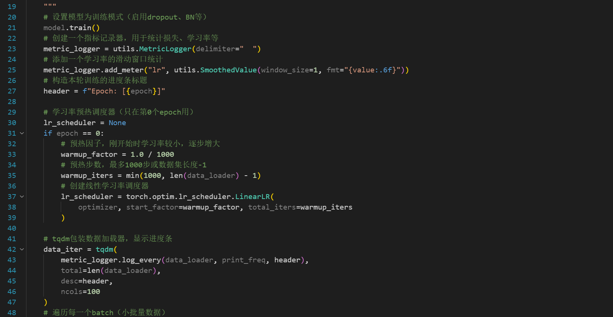

# 题目1 - 实验报告

 看到这个题目之后，我想了很多内容。这个是“基于神经网络的实例分割”，所以我必须首先构建神经网络，然后执行这个实例分割的任务。

 > 基于已有数据集或自制数据集，采用 PyTorch 或其他深度学习框架实现相应的神经网络搭建，进行模型训练，最终实现一个能够对 RGB 图像进行实例分割的算法。
 > 任务：实例分割
    1.实现一个基于神经网络的 RGB 图像实例分割算法；
    2.完成数据预处理模块（包括图像归一化、数据增强等）；
    3.设计或选择适当的网络架构进行实例分割的训练与预测；
    4.实现训练、验证、预测流程。

 我看到，最后的提示有：

 > 能够利用 pytorch 或其他深度学习框架构建主流的实例分割神经网络(如Mask R-CNN/YOLACT/SOLO 等)

 所以我们想先实现一个mask-r-cnn的神经网络，实现这个实例分割的算法。然后我们依照这个神经网络，再去决策下一步做的事情。

 首先我们看到，官方的mask-r-cnn网络是在Keras以及TensorFlow的，而之前我们接触的大多都是pytorch，并且题目也是推荐使用pytorch。然后我们看到，torchvision的官方文档中，有mask-r-cnn的实现，并且已经封装到vision库中，可以直接拿来调用。所以我们可以：

 1. 通过torchvision的调用，快速构建网络并且完成训练过程；
 2. 通过pytorch实现这个网络的全过程，包括数据加载、数据预处理、网络构建的全过程、训练、验证、预测等。

 这样，我们既可以简单、快速地进行训练，也可以从复现网络的全过程中，学习到更多的内容，以期待有改进的思路等。

 下面开始我们的实验进程。

## 1. Mask R-CNN流程

 我们查看mask r-cnn的论文，读取其中的关键部分，然后针对这个神经网络，对我们的流程进行编写。

 我们选取的是coco-2017数据集。直接从官网即可下载。`https://cocodataset.org/`

### 1.1 Torchvision实现

首先选择最好实现的torchvision构建并且训练。

#### 1.1.1 论文阅读

 首先我们应该通过论文，查看这个神经网络的实现，对这个网络的贡献和解决的问题有一个基础的了解，并且了解其和其他的实例分割的网络的不同之处，方便我们之后优化。
 `https://arxiv.org/abs/1703.06870`


 【todo】 这里需要自己补充完整论文内容哦，主要就是引言部分的扩写，不需要写具体的实现。可以配图。

 然后，我们就可以开始编写代码了。torchvision里面是有整个神经网络，在调用model的时候我们可以这么调用。但是在前期处理数据、进入训练/验证，以及可视化的阶段，我们都需要手动编写。其中，我们应用AI code。这可以帮助我们快速完成代码编写，同时也可以帮助我们保持全局的思路。

#### 1.1.2 数据预处理

我们使用的数据集是coco-2017。针对这个数据集，python有处理工具`pycocotools`，可以方便地处理这个数据集。


这里我们手写加载数据集的代码，里面的内容包括加载图片以及目标。其中，图片是用PIL加载的。其实我们也可以自己写数据加载的过程，适合我们的处理格式。
此处我们借鉴了`https://github.com/pytorch/vision/tree/main/references/detection` torchvision的参考实现，手动撰写读取函数如下：(主要的getitem函数)

```python
        # 1. 【数据加载】从COCO数据集获取图像和标注
        img, target = super(CocoInstanceDataset, self).__getitem__(idx)
        img_id = self.ids[idx]
        
        # 2. 【标注解析】获取该图像的所有标注ID和详细标注信息
        ann_ids = self.coco.getAnnIds(imgIds=img_id)
        anns = self.coco.loadAnns(ann_ids)

        # 3. 【数据预处理】提取边界框、标签和mask
        boxes = []
        labels = []
        masks = []
        
        for ann in anns:
            if 'bbox' in ann:
                # 【边界框处理】将COCO格式[x,y,w,h]转换为[x1,y1,x2,y2]
                x, y, w, h = ann['bbox']
                boxes.append([x, y, x + w, y + h])
                
                # 【标签处理】提取类别ID
                labels.append(ann['category_id'])
                
                # 【mask生成】将COCO多边形标注转换为二值mask
                mask = self.coco.annToMask(ann)
                masks.append(mask)

        # 4. 【张量转换】将列表转换为PyTorch张量
        boxes = torch.as_tensor(np.array(boxes), dtype=torch.float32)
        labels = torch.as_tensor(np.array(labels), dtype=torch.int64)
        masks = torch.as_tensor(np.array(masks), dtype=torch.uint8)

        # 5. 【目标字典组装】按照Mask R-CNN要求的格式组织数据
        target = {
            "boxes": boxes,        # 边界框 [N, 4]
            "labels": labels,      # 类别标签 [N]
            "masks": masks,        # 分割mask [N, H, W]
            "image_id": img_id  # 图像ID，改为int类型
        }

        # 6. 【图像预处理】应用图像变换（如果有的话）
        if self._transforms:
            img, target = self._transforms(img, target)
```

而后，在主函数里面可以写为：


进行数据记载。

随后进行数据增强。也就是上面的get_transform函数。同样仿照`vision/detetction`的实现，分为四类：

```python

class DetectionPresetTrain:
    """训练时数据增强预设，支持多种增强策略"""
    def __init__(
        self,
        data_augmentation="hflip",
        hflip_prob=0.5,
        mean=(123.0, 117.0, 104.0),
    ):
        transforms = []
        transforms += [PILToTensor()]
        
        # 根据不同策略选择数据增强
        if data_augmentation == "hflip":
            transforms += [RandomHorizontalFlip(p=hflip_prob)]
        elif data_augmentation == "lsj":
            transforms += [
                ScaleJitter(target_size=(1024, 1024), antialias=True),
                FixedSizeCrop(size=(1024, 1024), fill=list(mean)),
                RandomHorizontalFlip(p=hflip_prob),
            ]
        elif data_augmentation == "multiscale":
            transforms += [
                RandomShortestSize(min_size=(480, 512, 544, 576, 608, 640, 672, 704, 736, 768, 800), max_size=1333),
                RandomHorizontalFlip(p=hflip_prob),
            ]
        elif data_augmentation == "ssd":
            transforms += [
                RandomPhotometricDistort(),
                RandomZoomOut(fill=list(mean)),
                RandomIoUCrop(),
                RandomHorizontalFlip(p=hflip_prob),
            ]
        elif data_augmentation == "ssdlite":
            transforms += [
                RandomIoUCrop(),
                RandomHorizontalFlip(p=hflip_prob),
            ]
        else:
            raise ValueError(f'Unknown data augmentation policy "{data_augmentation}"')

        # 变换为dtype，方便后续处理
        
        transforms += [ToDtype(torch.float, scale=True)]

        self.transforms = Compose(transforms)

    def __call__(self, img, target):
        return self.transforms(img, target)

```

我们参考`https://github.com/pytorch/vision/tree/main/references/detection`不分，对于此处的数据增强只使用了`RandomHorizontalFlip`，即随机水平翻转。所以我们也只默认，实现随机水平翻转。


至此，我们实现了数据预处理部分。之后在主函数里面可以使用


通过数据加载器，对之后的数据进行加载，而且还可以进行加速。

#### 1.1.3 网络构建

 接下来，我们就可以开始构建网络了。关于网络构建的代码都放在torchvision的库里面。我们查看lib/site-packages/torchvision/models/detection/mask_rcnn.py，得到网络构建函数。

##### 1.1.3.1 函数调用

在torchvision/models/detection/__init__.py中，我们可以看到mask-r-cnn的调用函数.其中也区分v1,v2等版本。所以我们自己写的代码里面，我们直接调用最基础的版本：

```python

from torchvision.models.detection import maskrcnn_resnet50_fpn

    model = torchvision.models.detection.maskrcnn_resnet50_fpn(pretrained=True,
        num_classes = num_classes)

```

torchvision已经封装好了mask-r-cnn的网络，我们可以直接调用。下面对mask-r-cnn进行调用，同时进行类别数量修改，并且修改ROI头（适应新的类别数量）


 其中，num_classes是类别的数量。我们可以通过`dataset.num_classes`来获取。

 这个函数是经过main调用的，所以直接返回main函数，然后交给train函数。

##### 1.1.3.2 网络分析

这里我们直接查看torchvison的代码实现。

由于mask-r-cc网络主要有以下部分组成：

- Backbone：特征提取网络，通常是ResNet50+FPN。
- RPN（Region Proposal Network）：生成候选区域及其置信度
- RoIAlign: 区域对齐，统一采样
- ROI Heads：对候选区域ROI进行分类和回归。
- Mask Branch：生成分割掩码。
- Loss Function：计算多任务损失，包括分类、回归和掩码分支的损失。

所以我们从头开始：

首先观察到，mask-r-cnn的实现是继承自FasterRCNN的。所以基本的流程和其一致。

###### （1） Backbone

可以看到，通常我们选择ResNet50+FPN作为Backbone。即使我们自己选择，也是这样的。


其中，ResNet是特征提取网络，本质是多个卷积层+非线性变换+残差连接，通过多个卷积层，实现多个特征图的输出。


这里的resnet50和resnet_fpn都是torchvision的实现。我们可以选择直接调用。这个backone是我们自己选择的。当然可以选择其他的内容。weight是我们根据内置的下载链接，进行下载的。同时我们也可以选择是本地文件，即自己训练好的文件。

我们选择resnet进行特征提取，然后FPN 是 特征金字塔网络，选择fpn进行特征提取增强。

也即，当我们的resnet50输出多个层次的特征（如 C2、C3、C4、C5）的时候，C2是分辨率高，语义浅的层级，C5则是分辨率低，语义深的层级。FPN会将这些层级的特征进行融合（对高层语义特征逐层上采样，再与低层特征融合），生成多尺度的特征图。

这样，我们就实现了，把语义深的层级的语义信息传送到高分辨率的层级，实现了特征融合，增强了特征提取。

随后进入`model = MaskRCNN(backbone, num_classes=num_classes, **kwargs)`, 这里是直接继承的FasterRCNN的实现：`class MaskRCNN(FasterRCNN)`。

###### （2） RPN

我们看到，在MaskRCNN初始化的过程中，使用了backone的输出`backbone.out_channels`，这个是输出的通道数。随后就可以开始工作。


我们的mask-r-cnn的最重要的部分就是mask分支。也就是，如果没有传入对应的mask有关的内容，就直接构建。


随后就开始调用`FasterRCNN.__init__`来实现主结构了。这一过程，继承了faster-rcnn的backbone,rpn,RoIAlign + Box Head（分类 + 边框预测）等部分。最后加入mask分支。

所以我们来看`FasterRCNN.__init__`的实现：


这里就很容易看到，首先判断是否提供自定义 RPN Anchor 生成器和 Head，如果没有，就使用默认的 RPN Anchor Generator 和 RPN Head。这个继承于nn.Module的RPN Head，主要是做 proposal 分类 + 边框偏移预测。


随后使用这个生成器和rpn head来构建rpn，是`RegionProposalNetwork`函数实现。同样继承于nn.Module，是一个标准的 PyTorch 神经网络模块。它是是整个 RPN 的封装器，它做了三件事：

- 生成 anchors：使用 rpn_anchor_generator 在特征图上生成每个位置的 anchor（先验框）；
- 预测 objectness + offset：使用 rpn_head 判断每个 anchor 是不是物体，并预测位置偏移；
- 进行 NMS：对每张图提议框进行 non-maximum suppression，得到 proposal。

简单的说，就是，在 Backbone 提取的特征图上，生成高质量、数量有限的候选区域（proposals），供后续分类、回归和分割使用。（特征图->生成proposal）

可以简单用一张图概括RPN：


###### （3） RoIAlign

接下来是RoIAlign。这个是对候选区域进行对齐，统一采样。


我们可以看到，在代码里面，是通过MultiScaleRoIAlign来实现的。
之后我们查看代码，可以看到，RoIHeads 模块接收 RPN 提供的候选框 proposals，对其进行分类、回归边框、预测掩码，是 Mask R-CNN 中 第二阶段检测 + 实例分割 的核心逻辑。


其中的参数多种多样，例如box_roi_pool，就是对每个 proposal 区域在特征图上做 RoIAlign。box_predictor，就是分类 + 边框回归输出模块（输出 class_logits, box_regression）。mask_roi_pool，就是对 proposal 区域提取用于掩码的特征，mask_predictor 就是最终预测每个像素是否属于该类，等等。

forward 核心的三个阶段分别是：

- 1 - 分类与边框回归 Bounding box regression head（先Classification Head， 获取类别，判断ROI在哪一类。）
- 


我们可以看到，这个输入是proposals，也即是RPN生成的候选区域。随后用 RoIAlign 提取区域特征，用 FC 提取语义，最后输出分类得分 + 边框修正。

- 2 - 掩码预测 Mask_head


这个步骤是，从 positive proposals 中抽取掩码训练数据，然后计算掩码损失。最后损失加上掩码损失。

- 3 - 生成最终预测


我们可以看到，这个Loss是不断更新的，是因为这是多个任务的损失函数。包括分类损失、边框回归损失、掩码损失等。通过计算这些算是，我们最终得到了result以及loss。

###### （4） 拼接模块

完成上面三个模块（Backbone、RPN、RoIAlign）之后，我们就可以开始拼接模块了。

`super().__init__(backbone, rpn, roi_heads, transform)`

这个是调用了`GeneralizedRCNN`的函数，

至此，我们构建了所有的神经网络。回过头来看，大多都是faster-rcnn的实现。我们只需要在mask分支上进行修改即可。


#### 1.1.4 训练与验证

##### 1.1.4.1 学习率更新

在开始训练之前，我们需要在这里进行优化器和学习率的设置。

```python
    optimizer = torch.optim.SGD(
        model.parameters(),
        lr=args.lr,
        momentum=args.momentum,
        weight_decay=args.weight_decay
    ) # 可以只优化需要参数的梯度

    lr_scheduler = torch.optim.lr_scheduler.StepLR(
        optimizer, 
        step_size=args.lr_step_size, 
        gamma=args.lr_gamma
    ) # 这里学习率逐级递减，对每个epoch进行一次学习率的调整
```

随后，就可以进行训练过程了。

##### 1.1.4.2 训练过程

对epoch进行循环，进行训练。每一轮都应该有train_one_epoch函数进行训练。


而对于每一轮的训练，我们的步骤是：

- (1) 设置参数


开始是对一些参数的设置，初始化学习率，采用较小的学习率逐步线性上升，等等。
我们使用tqdm包装训练数据迭代器，加载统计条，所以设置好参数，方便加载。

- (2) 训练过程


这是我们的前向传播的过程，我们遍历 batch，前向传播与损失计算。同时，跳过数据异常的 batch等。

- (3) 反向传播


在这个过程，我们实现了反向传播与参数更新。同时，梯度清零，防止梯度累积。根据是否使用混合精度，选择 AMP 还是标准反向传播。然后权重更新，完成一次学习的过程。

- (4) 统计信息


这个是方便我们之后可视化的统计，包括各种loss，lr等数值。

至此，我们的一次训练完毕。

##### 1.1.4.3 验证过程

在主函数里面，我们实现一个epoch的训练之后，就可以开始验证。


验证的过程中，我们同样也可以保存内容，方便调用tensorboard进行可视化。

##### 1.1.5 可视化

在实现了训练和验证之后，我们就可以开始可视化了。调用torchvision的版本，我们有两个可视化：参数可视化； 预测结果可视化。

参数可视化，我们实现的逻辑是，在train中，每一轮的train，会保存一个batch的参数，包括：lr,loss_classifier, loss_box, loss_mask, loss_total. 在运行过程中，我们随时可以通过tensorboard查看这些参数的变化。


当我们训练完成之后，照样可以通过这个命令查看可视化结果。并且保存为本地的文件。


### 1.2 Pytorch实现

 上面我们是调用了torchvision的封装好的mask-r-cnn网络。但是里面的过程等等，都不是个人撰写。而是torchvision的格式。

 为了找到改进的方案，我决定从mask-r-cnn的神经网络开始，一步一步的亲自实现全过程。

 我们准备好了一些格式，便于存储之后的文件。其中的dataset目录下面是处理的数据集，然后transforms下面是对数据增强的操作。model文件夹下面就是我们实现的神经网络。

```
pytorch的目录结构如下：
 ├── dataset/         # 数据增强与加载目录
 |   ├── __init__.py      <-- 设置为python包，方便其他目录文件调用
 │   ├── coco_dataset.py  <-- COCO数据集加载
 ├── model/
 │   ├── __init__.py      <-- get_instance_segmentation_model()
 │   ├── backbone.py      <-- e.g., ResNet + FPN
 │   ├── rpn.py           <-- 提议区域 + anchor + RPNHead
 │   ├── roi_heads.py     <-- ROIAlign + 分类、回归、Mask分支
 │   ├── loss.py          <-- 多任务损失函数构建
 │   └── box_utils.py     <-- NMS, IoU, encode/decode boxes 等
 ├── result/   # 输出目录，存储模型、预测结果以及log
 |  ├── checkpoints/   # 模型检查点
 |  ├── logs/          # 日志文件
 |  ├── predictions/   # 预测结果
 ├── transforms/     # 数据增强目录
 |  ├── __init__.py
 |  ├── transforms.py   <-- 数据增强操作
 ├── visualization/     # 可视化结果，包括数据增强可视化以及预测结果可视化
 |  ├── __init__.py
 |  ├── dataset_visualize.py     <-- 数据增强可视化函数

```

#### 1.2.1 数据处理

和之前一样，我们首先选定了数据集，并且要对这个数据集进行加载以及增强处理。

