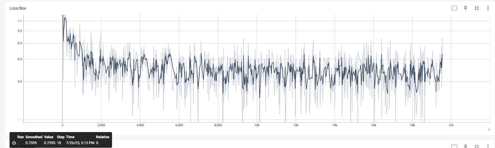
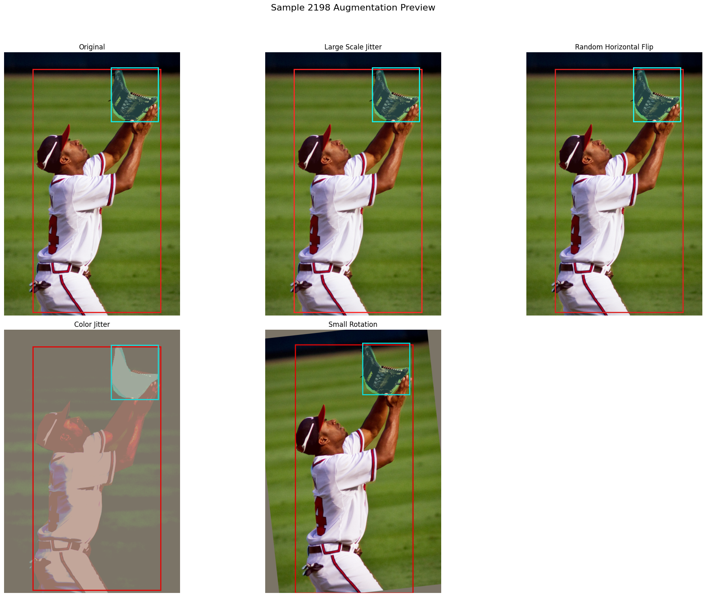

# 题目1 - 实验报告

 看到这个题目之后，我想了很多内容。这个是"基于神经网络的实例分割"，所以我必须首先构建神经网络，然后执行这个实例分割的任务。

 > 基于已有数据集或自制数据集，采用 PyTorch 或其他深度学习框架实现相应的神经网络搭建，进行模型训练，最终实现一个能够对 RGB 图像进行实例分割的算法。
 > 任务：实例分割
    1.实现一个基于神经网络的 RGB 图像实例分割算法；
    2.完成数据预处理模块（包括图像归一化、数据增强等）；
    3.设计或选择适当的网络架构进行实例分割的训练与预测；
    4.实现训练、验证、预测流程。

 我看到，最后的提示有：

 > 能够利用 pytorch 或其他深度学习框架构建主流的实例分割神经网络(如Mask R-CNN/YOLACT/SOLO 等)

 所以我们想先实现一个mask-r-cnn的神经网络，实现这个实例分割的算法。然后我们依照这个神经网络，再去决策下一步做的事情。

 首先我们看到，官方的mask-r-cnn网络是在Keras以及TensorFlow的，而之前我们接触的大多都是pytorch，并且题目也是推荐使用pytorch。然后我们看到，torchvision的官方文档中，有mask-r-cnn的实现，并且已经封装到vision库中，可以直接拿来调用。所以我们可以：

 1. 通过torchvision的调用，快速构建网络并且完成训练过程；
 2. 通过pytorch实现这个网络的全过程，包括数据加载、数据预处理、网络构建的全过程、训练、验证、预测等。

 这样，我们既可以简单、快速地进行训练，也可以从复现网络的全过程中，学习到更多的内容，以期待有改进的思路等。

 下面开始我们的实验进程。

## 1. Mask R-CNN流程

 我们查看mask r-cnn的论文，读取其中的关键部分，然后针对这个神经网络，对我们的流程进行编写。

 我们选取的是coco-2017数据集。直接从官网即可下载。`https://cocodataset.org/`

### 1.1 Torchvision实现

首先选择最好实现的torchvision构建并且训练。

#### 1.1.1 论文阅读（方法介绍）

 首先我们应该通过论文，查看这个神经网络的实现，对这个网络的贡献和解决的问题有一个基础的了解，并且了解其和其他的实例分割的网络的不同之处，方便我们之后优化。
 `https://arxiv.org/abs/1703.06870`


这篇论文通过在Faster R-CNN 框架中增加一个全卷积的 mask 分支，实现了对图像中每个目标实例的精确像素级分割。主要分为两个阶段，第一个阶段是使用 RPN（Region Proposal Network）生成候选区域；第二个阶段是对每个 RoI 提取特征，同时进行分类、回归和掩码预测处理。主要的流程如下：

1. 输入图像与特征提取。输入一张原始图像；使用一个卷积神经网络（如ResNet）作为骨干网络backbone提取图像的特征图，然后使用 FPN（Feature Pyramid Network）将不同尺度的特征结合，增强多尺度表达能力。
2. 生成候选区域（Region Proposal Network, RPN）。在特征图上滑动窗口，使用 RPN 网络生成一组候选目标框（region proposals），每个 proposal 是一个可能包含目标的矩形区域。
3. RoIAlign 特征对齐。将 RPN 提出的每个候选框投影到特征图中，使用 RoIAlign 操作精确提取与候选区域对应的固定大小特征，避免了 RoIPool 的空间量化误差。
4. 多任务预测分支。对每个 RoI 提取的特征，并行执行三种预测任务： 分类分支（Classification Head，预测该 RoI 属于哪个类别）， 边框回归分支（Bounding Box Regression Head，对候选框进行位置微调，输出更精确的边界框坐标）， 掩码预测分支（Mask Head，使用一个小型 FCN，为每个 RoI 输出一个二值掩码），每个类别对应一个掩码通道，最终选择分类分支预测的类别所对应的掩码。
5. 输出结果。根据分类分支的置信度进行 NMS（非极大值抑制），筛选出最终检测目标。对每个目标：输出类别标签、微调后的边界框坐标和掩码分支生成的二值分割掩码，并放大到目标实际大小；最终得到图像中每个目标的边框 + 类别 + 掩码信息。

了解了网络工作的流程，然后，我们就可以开始编写代码了。torchvision里面是有整个神经网络，在调用model的时候我们可以这么调用。但是在前期处理数据、进入训练/验证，以及可视化的阶段，我们都需要手动编写。其中，我们应用AI code。这可以帮助我们快速完成代码编写，同时也可以帮助我们保持全局的思路。

#### 1.1.2 数据预处理（实验设置1）

我们使用的数据集是coco-2017。针对这个数据集，python有处理工具`pycocotools`，可以方便地处理这个数据集。


这里我们手写加载数据集的代码，里面的内容包括加载图片以及目标。其中，图片是用PIL加载的。其实我们也可以自己写数据加载的过程，适合我们的处理格式。
此处我们借鉴了`https://github.com/pytorch/vision/tree/main/references/detection` torchvision的参考实现，手动撰写读取函数如下：(主要的getitem函数)

```python
        # 1. 【数据加载】从COCO数据集获取图像和标注
        img, target = super(CocoInstanceDataset, self).__getitem__(idx)
        img_id = self.ids[idx]
        
        # 2. 【标注解析】获取该图像的所有标注ID和详细标注信息
        ann_ids = self.coco.getAnnIds(imgIds=img_id)
        anns = self.coco.loadAnns(ann_ids)

        # 3. 【数据预处理】提取边界框、标签和mask
        boxes = []
        labels = []
        masks = []
        
        for ann in anns:
            if 'bbox' in ann:
                # 【边界框处理】将COCO格式[x,y,w,h]转换为[x1,y1,x2,y2]
                x, y, w, h = ann['bbox']
                boxes.append([x, y, x + w, y + h])
                
                # 【标签处理】提取类别ID
                labels.append(ann['category_id'])
                
                # 【mask生成】将COCO多边形标注转换为二值mask
                mask = self.coco.annToMask(ann)
                masks.append(mask)

        # 4. 【张量转换】将列表转换为PyTorch张量
        boxes = torch.as_tensor(np.array(boxes), dtype=torch.float32)
        labels = torch.as_tensor(np.array(labels), dtype=torch.int64)
        masks = torch.as_tensor(np.array(masks), dtype=torch.uint8)

        # 5. 【目标字典组装】按照Mask R-CNN要求的格式组织数据
        target = {
            "boxes": boxes,        # 边界框 [N, 4]
            "labels": labels,      # 类别标签 [N]
            "masks": masks,        # 分割mask [N, H, W]
            "image_id": img_id  # 图像ID，改为int类型
        }

        # 6. 【图像预处理】应用图像变换（如果有的话）
        if self._transforms:
            img, target = self._transforms(img, target)
```

而后，在主函数里面可以写为：


进行数据记载。

随后进行数据增强。也就是上面的get_transform函数。同样仿照`vision/detetction`的实现，分为四类：

```python

class DetectionPresetTrain:
    """训练时数据增强预设，支持多种增强策略"""
    def __init__(
        self,
        data_augmentation="hflip",
        hflip_prob=0.5,
        mean=(123.0, 117.0, 104.0),
    ):
        transforms = []
        transforms += [PILToTensor()]
        
        # 根据不同策略选择数据增强
        if data_augmentation == "hflip":
            transforms += [RandomHorizontalFlip(p=hflip_prob)]
        elif data_augmentation == "lsj":
            transforms += [
                ScaleJitter(target_size=(1024, 1024), antialias=True),
                FixedSizeCrop(size=(1024, 1024), fill=list(mean)),
                RandomHorizontalFlip(p=hflip_prob),
            ]
        elif data_augmentation == "multiscale":
            transforms += [
                RandomShortestSize(min_size=(480, 512, 544, 576, 608, 640, 672, 704, 736, 768, 800), max_size=1333),
                RandomHorizontalFlip(p=hflip_prob),
            ]
        elif data_augmentation == "ssd":
            transforms += [
                RandomPhotometricDistort(),
                RandomZoomOut(fill=list(mean)),
                RandomIoUCrop(),
                RandomHorizontalFlip(p=hflip_prob),
            ]
        elif data_augmentation == "ssdlite":
            transforms += [
                RandomIoUCrop(),
                RandomHorizontalFlip(p=hflip_prob),
            ]
        else:
            raise ValueError(f'Unknown data augmentation policy "{data_augmentation}"')

        # 变换为dtype，方便后续处理
        
        transforms += [ToDtype(torch.float, scale=True)]

        self.transforms = Compose(transforms)

    def __call__(self, img, target):
        return self.transforms(img, target)

```

我们参考`https://github.com/pytorch/vision/tree/main/references/detection`不分，对于此处的数据增强只使用了`RandomHorizontalFlip`，即随机水平翻转。所以我们也只默认，实现随机水平翻转。


至此，我们实现了数据预处理部分。之后在主函数里面可以使用


通过数据加载器，对之后的数据进行加载，而且还可以进行加速。

#### 1.1.3 网络构建（模型结构）

接下来，我们就可以开始构建网络了。关于网络构建的代码都放在torchvision的库里面。我们查看lib/site-packages/torchvision/models/detection/mask_rcnn.py，得到网络构建函数。

##### 1.1.3.1 函数调用

在torchvision/models/detection/__init__.py中，我们可以看到mask-r-cnn的调用函数.其中也区分v1,v2等版本。所以我们自己写的代码里面，我们直接调用最基础的版本：

```python

from torchvision.models.detection import maskrcnn_resnet50_fpn

    model = torchvision.models.detection.maskrcnn_resnet50_fpn(pretrained=True,
        num_classes = num_classes)

```

torchvision已经封装好了mask-r-cnn的网络，我们可以直接调用。下面对mask-r-cnn进行调用，同时进行类别数量修改，并且修改ROI头（适应新的类别数量）


 其中，num_classes是类别的数量。我们可以通过`dataset.num_classes`来获取。

 这个函数是经过main调用的，所以直接返回main函数，然后交给train函数。

##### 1.1.3.2 网络分析

这里我们直接查看torchvison的代码实现。

由于mask-r-cc网络主要有以下部分组成：

- Backbone：特征提取网络，通常是ResNet50+FPN。
- RPN（Region Proposal Network）：生成候选区域及其置信度
- RoIAlign: 区域对齐，统一采样
- ROI Heads：对候选区域ROI进行分类和回归。
- Mask Branch：生成分割掩码。
- Loss Function：计算多任务损失，包括分类、回归和掩码分支的损失。

所以我们从头开始：

首先观察到，mask-r-cnn的实现是继承自FasterRCNN的。所以基本的流程和其一致。

###### （1） Backbone

可以看到，通常我们选择ResNet50+FPN作为Backbone。即使我们自己选择，也是这样的。


其中，ResNet是特征提取网络，本质是多个卷积层+非线性变换+残差连接，通过多个卷积层，实现多个特征图的输出。


这里的resnet50和resnet_fpn都是torchvision的实现。我们可以选择直接调用。这个backone是我们自己选择的。当然可以选择其他的内容。weight是我们根据内置的下载链接，进行下载的。同时我们也可以选择是本地文件，即自己训练好的文件。

我们选择resnet进行特征提取，然后FPN 是 特征金字塔网络，选择fpn进行特征提取增强。

也即，当我们的resnet50输出多个层次的特征（如 C2、C3、C4、C5）的时候，C2是分辨率高，语义浅的层级，C5则是分辨率低，语义深的层级。FPN会将这些层级的特征进行融合（对高层语义特征逐层上采样，再与低层特征融合），生成多尺度的特征图。

这样，我们就实现了，把语义深的层级的语义信息传送到高分辨率的层级，实现了特征融合，增强了特征提取。

随后进入`model = MaskRCNN(backbone, num_classes=num_classes, **kwargs)`, 这里是直接继承的FasterRCNN的实现：`class MaskRCNN(FasterRCNN)`。

###### （2） RPN

我们看到，在MaskRCNN初始化的过程中，使用了backone的输出`backbone.out_channels`，这个是输出的通道数。随后就可以开始工作。


我们的mask-r-cnn的最重要的部分就是mask分支。也就是，如果没有传入对应的mask有关的内容，就直接构建。


随后就开始调用`FasterRCNN.__init__`来实现主结构了。这一过程，继承了faster-rcnn的backbone,rpn,RoIAlign + Box Head（分类 + 边框预测）等部分。最后加入mask分支。

所以我们来看`FasterRCNN.__init__`的实现：


这里就很容易看到，首先判断是否提供自定义 RPN Anchor 生成器和 Head，如果没有，就使用默认的 RPN Anchor Generator 和 RPN Head。这个继承于nn.Module的RPN Head，主要是做 proposal 分类 + 边框偏移预测。


随后使用这个生成器和rpn head来构建rpn，是`RegionProposalNetwork`函数实现。同样继承于nn.Module，是一个标准的 PyTorch 神经网络模块。它是是整个 RPN 的封装器，它做了三件事：

- 生成 anchors：使用 rpn_anchor_generator 在特征图上生成每个位置的 anchor（先验框）；
- 预测 objectness + offset：使用 rpn_head 判断每个 anchor 是不是物体，并预测位置偏移；
- 进行 NMS：对每张图提议框进行 non-maximum suppression，得到 proposal。

简单的说，就是，在 Backbone 提取的特征图上，生成高质量、数量有限的候选区域（proposals），供后续分类、回归和分割使用。（特征图->生成proposal）

可以简单用一张图概括RPN：


###### （3） RoIAlign

接下来是RoIAlign。这个是对候选区域进行对齐，统一采样。


我们可以看到，在代码里面，是通过MultiScaleRoIAlign来实现的。
之后我们查看代码，可以看到，RoIHeads 模块接收 RPN 提供的候选框 proposals，对其进行分类、回归边框、预测掩码，是 Mask R-CNN 中 第二阶段检测 + 实例分割 的核心逻辑。


其中的参数多种多样，例如box_roi_pool，就是对每个 proposal 区域在特征图上做 RoIAlign。box_predictor，就是分类 + 边框回归输出模块（输出 class_logits, box_regression）。mask_roi_pool，就是对 proposal 区域提取用于掩码的特征，mask_predictor 就是最终预测每个像素是否属于该类，等等。

forward 核心的三个阶段分别是：

- 1 - 分类与边框回归 Bounding box regression head（先Classification Head， 获取类别，判断ROI在哪一类。）
- 


我们可以看到，这个输入是proposals，也即是RPN生成的候选区域。随后用 RoIAlign 提取区域特征，用 FC 提取语义，最后输出分类得分 + 边框修正。

- 2 - 掩码预测 Mask_head


这个步骤是，从 positive proposals 中抽取掩码训练数据，然后计算掩码损失。最后损失加上掩码损失。

- 3 - 生成最终预测


我们可以看到，这个Loss是不断更新的，是因为这是多个任务的损失函数。包括分类损失、边框回归损失、掩码损失等。通过计算这些算是，我们最终得到了result以及loss。

###### （4） 拼接模块

完成上面三个模块（Backbone、RPN、RoIAlign）之后，我们就可以开始拼接模块了。

`super().__init__(backbone, rpn, roi_heads, transform)`

这个是调用了`GeneralizedRCNN`的函数，

至此，我们构建了所有的神经网络。回过头来看，大多都是faster-rcnn的实现。我们只需要在mask分支上进行修改即可。


#### 1.1.4 训练与验证（实验设置2）

##### 1.1.4.1 学习率更新

在开始训练之前，我们需要在这里进行优化器和学习率的设置。

```python
    optimizer = torch.optim.SGD(
        model.parameters(),
        lr=args.lr,
        momentum=args.momentum,
        weight_decay=args.weight_decay
    ) # 可以只优化需要参数的梯度

    lr_scheduler = torch.optim.lr_scheduler.StepLR(
        optimizer, 
        step_size=args.lr_step_size, 
        gamma=args.lr_gamma
    ) # 这里学习率逐级递减，对每个epoch进行一次学习率的调整
```

随后，就可以进行训练过程了。

##### 1.1.4.2 训练过程

对epoch进行循环，进行训练。每一轮都应该有train_one_epoch函数进行训练。


而对于每一轮的训练，我们的步骤是：

- (1) 设置参数


开始是对一些参数的设置，初始化学习率，采用较小的学习率逐步线性上升，等等。
我们使用tqdm包装训练数据迭代器，加载统计条，所以设置好参数，方便加载。

- (2) 训练过程


这是我们的前向传播的过程，我们遍历 batch，前向传播与损失计算。同时，跳过数据异常的 batch等。

- (3) 反向传播


在这个过程，我们实现了反向传播与参数更新。同时，梯度清零，防止梯度累积。根据是否使用混合精度，选择 AMP 还是标准反向传播。然后权重更新，完成一次学习的过程。

- (4) 统计信息


这个是方便我们之后可视化的统计，包括各种loss，lr等数值。

至此，我们的一次训练完毕。

##### 1.1.4.3 验证过程

在主函数里面，我们实现一个epoch的训练之后，就可以开始验证。


验证的过程中，我们同样也可以保存内容，方便调用tensorboard进行可视化。

#### 1.1.5 可视化（实验结果分析）

在实现了训练和验证之后，我们就可以开始可视化了。调用torchvision的版本，我们有两个可视化：参数可视化； 预测结果可视化。

(1)参数可视化，我们实现的逻辑是，在train中，每一轮的train，会保存一个batch的参数，包括：lr,loss_classifier, loss_box, loss_mask, loss_total. 在运行过程中，我们随时可以通过tensorboard查看这些参数的变化。

`/home/lishengjie/miniconda3/envs/mask_rcnn/bin/tensorboard --logdir=/home/lishengjie/study/sum_hansf/bupt_summer/mask-r-cnn/torchvision/result/three/tensorboard/ --port=9999`


当我们训练完成之后，照样可以通过这个命令查看可视化结果。并且保存为本地的文件。

(2)预测结果可视化，我们同样可以调用demo.py（批次处理，部分可视化）或者demo_one.py（单张图片可视化），实现预测结果的可视化。

`pytho demo.py`
`python demo_one.py`


我们的思路就是，使用pth进行一次验证，然后输出验证结果。原图+mask放到一个图片里面。

我们最终得到的结果是：

##### 1.1.5.1 参数可视化

经过我们的train，保存参数到`result/maskrcnn_2025-07-26_06-16-53/tensorboard`目录下，然后调用tensorboard查看。

```
tensorboard --logdir=result/maskrcnn_2025-07-26_06-16-53/tensorboard
```

结果可以显示loss变化。





其次，也可以看到map的变化。由于我们训练次数太少只有3个epoch，所以map的趋势不是很明显。同时也防止coco数据集过拟合，所以我们的map参数仅供参考。


对数据进行分析，我们可以查看到，各类loss都是呈现一个下降的趋势，总的loss从原来的5下降到之后的0.75左右，是有比较大的变化的。
由于一次epoch的训练batch有20k左右，所以我们的战线拉的比较长。我们可以取得其中的一部分（18-2400）查看：

最后得知，下降了80%左右。该网络的训练效果还是比较好的。

最后，我们也可以对所有的参数进行可视化查看。


我们可以看到总的参数变化，比较好。

##### 1.1.5.2 预测结果可视化

对于我们的网络，需要查看一些预测任务的输出。我们查看实验任务书，给我们的输出要求是：`输出包括但不限于预测边界框(bounding-box)以及实例掩码(mask)等`。所以可视化结果主要在这里出现：

（1） 单张图片可视化

我们设置的是，对于一张图片，就显示所有的内容。包括mask,预测框，预测类别，置信度，等等。

例如：


这个例子中，我们可以看到，预测的mask是比较好的。并且预测框也比较好。置信度也是比较高的。包括我们的mask也可以很贴切的描述目标的像素形状。

（2） 批次处理可视化

我们设置了demo.py，对一批序列进行可视化，并且分为下面的六种，方便我们观察。

1. 原图
2. 预测框+类别+置信度
3. 仅mask，方便我们查看形状
4. 原图+mask，方便与原图对应
5. 原图+类别+mask，方便对应类别，这是我们想要的结果。
6. 全部的结果，输出框、类别、置信度、mask。

结果如下：


同时，对每一张结果，我们都实现了保存到本地，以及远程浏览器查看，方便我们研究问题所在。我们在本地的`mask-r-cnn/torchvision/result/result_pngs/seq`实现了保存。

这里，右上角的mask方便我们查看mask的准确度，也方柏霓之后和其他的方案进行对比。

至此，我们的torchvision实现mask-r-cnn的流程已经完成。

### 1.2 Pytorch实现

 上面我们是调用了torchvision的封装好的mask-r-cnn网络。但是里面的网络构建过程不是个人撰写，所以对于理解前向传播或者反向传播等，不是那么容易查看。

 为了找到改进的方案，我决定从mask-r-cnn的神经网络开始，一步一步的亲自实现全过程。

 我们准备好了一些格式，便于存储之后的文件。其中的dataset目录下面是处理的数据集，然后transforms下面是对数据增强的操作。model文件夹下面就是我们实现的神经网络。

```
pytorch的目录结构如下：
 ├── dataset/         # 数据增强与加载目录
 |   ├── __init__.py      <-- 设置为python包，方便其他目录文件调用
 │   ├── coco_dataset.py  <-- COCO数据集加载
 ├── model/
 │   ├── __init__.py      <-- get_instance_segmentation_model()
 │   ├── backbone.py      <-- e.g., ResNet + FPN
 │   ├── rpn.py           <-- 提议区域 + anchor + RPNHead
 │   ├── roi_heads.py     <-- ROIAlign + 分类、回归、Mask分支
 │   ├── loss.py          <-- 多任务损失函数构建
│   │   ├── anchor.py            # Anchor生成与处理
│   │   ├── boxes.py             # 边界框工具(IoU, NMS等)
│   │   ├── general.py           # 通用工具函数
│   │   ├── loss.py              # 损失函数
│   │   ├── misc_nn_ops.py       # 其他神经网络操作
│   │   ├── poolers.py           # RoIAlign/RoIPool实现
│   │   └── roi_align.py         # RoIAlign的Python实现
│   ├── __init__.py
│   └── model_build.py           # 模型构建总入口
├── result/                      # 实验结果输出目录
├── train/
│   ├── evaluate.py              # 验证模块
│   └── train.py                 # 训练模块
├── transforms/
│   └── mask_rcnn_transforms.py  # 数据增强实现
└── visualization/
    ├── demo.py                  # 批量图片预测与可视化
    └── demo_one.py              # 单张图片预测与可视化
```

下面，我们逐个文件来撰写并且分析。

#### 1.2.1 数据处理

和之前一样，我们首先选定了数据集，并且要对这个数据集进行加载以及增强处理。照样选的是coco2017的数据集。

##### 1.2.1.1 数据加载

方便查看以及使用，我们以`pytorch`文件夹作为根目录，下面都是相对路径。

`dataset/coco_dataset.py`[查看程序](../mask-r-cnn/pytorch/dataset/coco_dataset.py)

在这个文件中，我们定义了 COCODataset 类，用于加载 COCO 数据集。
这里主要是使用pycocotools库，来加载coco数据集。里面主要包括五部分：

###### 1.2.1.1.1 `COCODataset`类

这个类继承自torch.utils.data.Dataset，实现了__getitem__和__len__方法，用于加载和处理数据。其中的方法有：

- `__init__`：初始化数据集，设置数据集路径、标注文件路径、数据增强方式、类别信息等。会在控制台输出：`加载了 {len(self.ids)} 张图像，{len(self.cat_ids)} 个类别`。

- `__getitem__`：获取指定索引的图像和标注信息。这个是我们的核心部分。也就是：
 （1） 传入index，根据index，读取我们之前加载好的数据集内容，然后使用PIL读取图片，并且转化为tensor格式。
 
 ```python
    img_path = os.path.join(self.root, path)
    img = Image.open(img_path).convert('RGB')
    img = F.pil_to_tensor(img).float() / 255.0
 ```

 （2） 获取原始尺寸（从 COCO 元数据），包括width和height。由于读取出来了img_info = coco.loadImgs(img_id)[0]，所以直接获得img_info['width']和img_info['height']即可。

 （3） 获取标注信息，包括boxes, labels, masks, iscrowd, area。最后总结成一个target字典，方便我们传入前面。也就是，一张图片由两部分组成：target和img。

 

 （4） 根据我们的transforms，对图片进行预处理。预处理部分根据我们主函数的输入来决定。

 （5） 返回img和target。这是一张图片的完整数据。

- `__len__`：返回数据集的长度，即图像数量。这个很容易实现，`return len(self.ids)`即可。

###### 1.2.1.1.2 `create_coco_dataloader`

这个是我们的主要函数。因为看我们使用这个来创建数据加载器，方便之后加载train和val数据集。其中有三个重要的部分。我们先查看一下全貌：


其中首先是准备我们的数据路径以及transforms等级。这个是我们的主函数输入来的`augmentation_level`。接下来就可以进行：

- 数据增强。我们通过函数`build_mask_rcnn_transforms`构建数据转化方式。其中数据增强分为四个等级，这个函数根据我们的参数，决定我们的数据增强中有哪些处理。


比如这里，我们一开始的输入是1级，只有水平翻转一个增强处理。这也是和我们的torchvision的实现是保持一致的。

- `build_coco_dataset`：这个函数是我们加载数据集的函数。根据我们的数据路径，加载coco数据集，并且返回一个COCODataset对象。这个就是我们刚才说的，那个COCODataset类的init函数。


- `build_dataloader`：这个函数是我们创建数据加载器的函数。根据我们的数据集对象，创建一个torch.utils.data.DataLoader对象。这个是我们之后训练和验证的主要数据加载器。


后续，我们调用数据加载器进行数据加载的时候，就是根据这个batch来加载，合理利用我们的计算资源。一个批次我们目前设置的是4，可以根据显存大小进行设置。

##### 1.2.1.2 数据增强

`transforms/mask_rcnn_transforms.py`:[数据增强部分](../mask-r-cnn/pytorch/transforms/mask_rcnn_transforms.py)

下面我们着重看一下这个数据增强模块。因为数据集加载和数据加载器的构建，我们都直接调用torch.utils.data的类就可以构建，但是数据增强是我们自由书写并且自由选择的。

这里我们主要实现了三个部分：

###### 1.2.1.2.1 数据增强函数

由于之前我们把图片读取的pil格式转换为了tensor格式，所以我们的数据增强函数主要是根据tensor格式进行处理和转换。主要分为下面几个：

- `RandomHorizontalFlip`：这是最基础的处理函数，即随机水平翻转。我们可以设置概率，默认是0.5。主要是继承了`torchvision.transforms.RandomHorizontalFlip`，并且重写了方法。


这里我们重写了forward，就使其能够同时处理图像和对应的标注信息（边界框和掩码）。

- `LargeScaleJitter`：这是一个大规模抖动函数，用于随机缩放图像到指定范围。由之前的一篇论文提出。我们可以设置最小和最大缩放比例，默认是0.5到2.0。


这里既对img进行了处理，resize，同时也对target的标签进行缩放，使得我们有了大规模抖动的效果。我们以一定的概率，将图像和其对应的标注（边界框、掩码、面积）按一个随机比例进行缩放。

- `ColorJitterTransform`：这是一个颜色抖动函数，用于随机改变图像的亮度、对比度、饱和度和色调。我们可以设置每个参数的范围。我们设置了默认的函数，方便开始的时候创建这个效果并且合理地调用。


这里我们也是主要继承于`torchvision.transforms.ColorJitter`，并且重写了`__call__`方法。我们可以看到，这个函数是对图像的颜色进行随机变化，以一定的概率对图像的亮度、对比度、饱和度和色调进行随机调整。增强模型的鲁棒性。同时我们设置了概率prob，也就是有一定的概率进行颜色抖动。保证了我们的样本数据的随机性。这个变换只影响图像，不影响标注。

- `RandomGrayscale`: 这是一个随机灰度化函数，用于将图像转换为灰度图像。同样，也是继承于`torchvision.transforms.RandomGrayscale`，并且重写了`__call__`方法，同时设置了新的概率。


灰度后大小等不变。这里我们调用的时候p=1.0，表示100%的概率进行灰度化。这个灰度化对我们的图像处理有一个比较鲁棒的效果。很适合处理夜间的数据。

- `Normalize` 归一化函数，这个应该是最重要的一个函数了。归一化：使用给定的均值和标准差对图像张量进行标准化。


归一化的意思是，对图像进行标准化处理，使得图像的均值为0，方差为1。这个是对图像进行预处理的一个重要步骤。我们可以设置均值和标准差，默认是`mean=(0.485, 0.456, 0.406)`和`std=(0.229, 0.224, 0.225)`。其中mean就是均值，std就是标准差。这个是根据ImageNet数据集的统计值来设置的。我们可以根据自己的数据集进行调整。

- `Resize`：这是一个调整图像大小的函数，用于将图像调整为指定的大小。我们可以设置目标大小，默认是(800, 800)。


resize是将图像的短边缩放到 `min_size`，同时确保长边不超过 `max_size`，并保持图像的原始长宽比。这在目标检测模型（如Faster R-CNN, Mask R-CNN）中是标准的预处理步骤。因此我们无论是否添加其他的步骤，这个resize都是必须的。

- `SmallRotation`：这是一个小角度旋转函数，用于对图像进行小角度旋转。我们可以设置旋转的角度范围，默认是(-10, 10)。


我们要旋转图像、旋转掩码以及计算之后的边界框、标签和面积等。这里的处理比较多，是图像和标签一起处理。根据我们最后标签所在的位置，进行更新target的所有内容。

- `SafeRandomCrop`：这是一个安全随机裁剪函数，用于对图像进行随机裁剪。以一定概率从图像的边缘随机裁剪掉一部分，但会尽量保证裁剪后的图像中，原有的物体实例（instance）大部分被保留下来。


和随机裁剪不同的是，我们计算了高级裁剪后，会保留安全的部分，也就是大多数物体实例都在裁剪后的图像中。这样可以避免裁剪掉重要的物体实例。
同时，我们也会更新target的内容，保证裁剪后的图像和标签是一一对应的。安全裁剪不会裁剪大多数的内容，只会裁剪掉一些边缘的内容。把中心位置留出来。

- `MotionBlur`：这是一个运动模糊函数，用于对图像进行运动模糊处理。
  


我们以一定概率为图像添加运动模糊效果，模拟相机或物体在曝光期间的运动。步骤基本上就是，首先创建一个运动模糊的卷积核。然后转换为 PyTorch 张量，利用分组卷积的方法，对每个通道独立应用模糊核，然后更新图像张量。

- `RandomPerspective`：这是一个随机透视变换函数，用于对图像进行随机透视变换。


同样的，也是对于图像以及target的内容进行处理。类似于 `SmallRotation`，变换后也会根据新的掩码重新计算边界框。经过这个变换，我们可以得到一个透视转换的图像，但是对于实例分割的图像来说，精确度太低。所以一般我们不使用这个增强方式。对于其他的处理方式，还是可以的。

###### 1.2.1.2.2 组合变换函数

这里我们使用`Compose`函数，将上述的所有变换函数组合起来，形成一个完整的数据增强流程。


这个过程在深度学习里面很常见，到时候需要增强的时候，直接调用这个函数，我们就可以得到增强。

###### 1.2.1.2.3 构建数据增强流水线

上述都是我们为了进行数据增强准备的流程。准备好各个函数，我们就可以使用一个函数来调用这些函数，并且提供给前面便于调用。这样，就可以真正的实现，数据加载的时候，进行增强。


大致流程就是这样，我们接受前方主函数的参数，也就是数据增强的等级。然后根据等级，添加数据增强的函数，最后返回一个compose函数。待到需要的时候，我们就会进行调用。

##### 1.2.1.3 数据增强可视化

`visualization/dataset_visualize.py`:[数据增强可视化](../mask-r-cnn/pytorch/visualization/dataset_visualize.py)

在最后，我们对以上的数据增强方式实现了可视化，方便我们查看数据增强的效果，据此来选择我们的数据增强方式。


这里我们使用服务器端来显示数据增强的效果。对每张图片，数据增强都过了一遍。据此我们发现数据增强的好坏。

结果显示，随机变换透视、运动模糊、小角度旋转等，不适合实例分割任务的数据增强，所以我们就不选择实现这个。我们默认只实现随机水平翻转，并且概率为0.5.

#### 1.2.2 网络构建

在`model/`目录中，我们实现了Mask R-CNN网络的所有关键组件。我们借鉴了`torchvision`的实现思路，将模型解耦为Backbone、RPN、RoI Heads等多个模块，并最终将它们组装起来。

参考仓库：

[torchvision/references/detection/](https://github.com/pytorch/vision/tree/main/torchvision/references/detection)

[mask-r-cnn](https://github.com/facebookresearch/maskrcnn-benchmark)

首先，我们更新一下`pytorch`实现方案的目录结构：
```
pytorch/
├── config/
│   └── coco_config.yaml         # 配置文件，存储超参数和路径
├── dataset/
│   └── coco_dataset.py          # COCO数据集加载与数据加载器创建
├── main.py                      # 主入口文件，负责启动训练、验证流程
├── model/
│   ├── backbone/
│   │   ├── fpn.py               # Feature Pyramid Network (FPN)
│   │   └── resnet50.py          # ResNet50骨干网络
│   ├── heads/
│   │   └── roi_head.py          # RoIHeads，包含分类、回归和Mask分支
│   ├── rcnn/
│   │   ├── faster_rcnn.py       # Faster R-CNN基础模型
│   │   ├── general_rcnn.py      # 通用R-CNN模型框架
│   │   └── mask_rcnn.py         # Mask R-CNN模型
│   ├── rpn/
│   │   └── rpn.py               # Region Proposal Network (RPN)
│   ├── utils/
│   │   ├── anchor.py            # Anchor生成与处理
│   │   ├── boxes.py             # 边界框工具(IoU, NMS等)
│   │   ├── general.py           # 通用工具函数
│   │   ├── loss.py              # 损失函数
│   │   ├── misc_nn_ops.py       # 其他神经网络操作
│   │   ├── poolers.py           # RoIAlign/RoIPool实现
│   │   └── roi_align.py         # RoIAlign的Python实现
│   ├── __init__.py
│   └── model_build.py           # 模型构建总入口
├── result/                      # 实验结果输出目录
├── train/
│   ├── evaluate.py              # 验证模块
│   └── train.py                 # 训练模块
├── transforms/
│   └── mask_rcnn_transforms.py  # 数据增强实现
└── visualization/
    ├── demo.py                  # 批量图片预测与可视化
    └── demo_one.py              # 单张图片预测与可视化
```

现在，我们从backbone走起，一步一步查看mask r-cnn构建的全过程。


我们的目标是完成从Backbone进行特征提取，然后使用RPN来提取候选区域，接着通过 RoI Align 进行对齐，再通过几个Head网络得出最终的分类、边界框和像素级掩码的完整流程。

##### 1.2.2.1 Backbone (ResNet50 + FPN)

文件: `model/backbone/resnet50.py`, `model/backbone/fpn.py`

Backbone是整个Mask R-CNN网络的基础，负责从输入图像中提取层次化的特征图。经过对比多种特征提取网络后，我们采用了经典且高效的 **ResNet50 + FPN** 架构，这也是目前实例分割任务中最常用的骨干网络组合之一。

###### 1.2.2.1.1 ResNet50 实现

在 `resnet50.py` 中，我们实现了标准的ResNet50网络。ResNet的核心创新是引入了残差连接（residual connection），有效解决了深层网络的梯度消失问题。

```python
# 定义3x3卷积，ResNet的基本组件
def conv3x3(in_planes: int, out_planes: int, stride: int = 1, groups: int = 1, dilation: int = 1) -> nn.Conv2d:
    """
    创建一个 3x3 的卷积层，带有固定的 padding。
    这是 ResNet 中最常用的卷积核尺寸之一。
    """
    return nn.Conv2d(
        in_planes,
        out_planes,
        kernel_size=3,
        stride=stride,
        padding=dilation,
        groups=groups,
        bias=False,
        dilation=dilation,
    )

# Bottleneck残差块，ResNet50的核心构建单元
class Bottleneck(nn.Module):
    """
    ResNet 的瓶颈残差块 (Bottleneck Residual Block)。
    主要用于更深的网络，如 ResNet-50, 101, 152，计算效率更高。
    结构为：
        conv1x1 -> bn -> relu  (降维)
        conv3x3 -> bn -> relu  (特征提取，可能会有 stride)
        conv1x1 -> bn          (升维)
    然后将输出与 identity 相加，再通过 relu 激活。
    """
    expansion: int = 4  # Bottleneck 块的输出通道数是输入 planes 的 4 倍
    
    def forward(self, x: Tensor) -> Tensor:
        identity = x

        # 主路径前向传播
        out = self.conv1(x)
        out = self.bn1(out)
        out = self.relu(out)

        out = self.conv2(out)
        out = self.bn2(out)
        out = self.relu(out)

        out = self.conv3(out)
        out = self.bn3(out)

        # 如果需要下采样（即输入和输出维度不匹配），则对输入进行调整
        if self.downsample is not None:
            identity = self.downsample(x)

        # 残差连接：将调整后的输入与主路径输出相加
        out += identity
        out = self.relu(out)

        return out
```

ResNet50的整体结构由多个层次的Bottleneck块组成，通过逐层堆叠形成深层网络：

```python
# ResNet50的主体结构
self.conv1 = nn.Conv2d(3, self.inplanes, kernel_size=7, stride=2, padding=3, bias=False)
self.bn1 = norm_layer(self.inplanes)
self.relu = nn.ReLU(inplace=True)
self.maxpool = nn.MaxPool2d(kernel_size=3, stride=2, padding=1)

# 四个残差层，对应C2, C3, C4, C5
self.layer1 = self._make_layer(block, 64, layers[0])
self.layer2 = self._make_layer(block, 128, layers[1], stride=2)
self.layer3 = self._make_layer(block, 256, layers[2], stride=2)
self.layer4 = self._make_layer(block, 512, layers[3], stride=2)
```

通过这种结构，ResNet50能够生成多个不同尺度的特征图（C2, C3, C4, C5），它们具有不同的感受野和语义级别：
- **C2**: 分辨率高，感受野小，包含丰富的低级特征（如边缘、纹理）
- **C3**: 中等分辨率，开始捕捉一些中级语义信息
- **C4**: 分辨率较低，感受野较大，包含更多语义信息
- **C5**: 分辨率最低，感受野最大，语义信息最丰富，但空间细节最少

这种层次化的特征表示对于实例分割任务至关重要，因为它既需要精确的空间定位（来自低层特征），又需要准确的语义理解（来自高层特征）。

###### 1.2.2.1.2 FPN (Feature Pyramid Network) 实现

仅使用ResNet50的输出特征是不够的，因为高层特征虽然语义信息丰富，但空间分辨率低，不利于精确的掩码预测。为解决这个问题，在 `fpn.py` 中，我们实现了特征金字塔网络（FPN）：

```python
class FeaturePyramidNetwork(nn.Module):
    """
    特征金字塔网络 (Feature Pyramid Network) 模块。
    FPN 通过自顶向下的路径和横向连接来增强标准卷积网络的特征层次结构。
    """

    def __init__(
        self,
        in_channels_list: List[int],
        out_channels: int,
        extra_blocks: Optional[ExtraFPNBlock] = None,
        norm_layer: Optional[Callable[..., nn.Module]] = None,
    ):
        super().__init__()
        
        # `inner_blocks` 用于处理横向连接 (lateral connection)
        # 它们是 1x1 卷积，用于将骨干网络输出的特征图通道数统一到 `out_channels`
        self.inner_blocks = nn.ModuleList()
        # `layer_blocks` 用于在横向连接和自顶向下路径融合后进行处理
        # 它们是 3x3 卷积，用于平滑融合后的特征，减少上采样带来的混叠效应
        self.layer_blocks = nn.ModuleList()
        
        for in_channels in in_channels_list:
            # 1x1 卷积，用于横向连接
            inner_block_module = Conv2dNormActivation(
                in_channels, out_channels, kernel_size=1, padding=0, 
                norm_layer=norm_layer, activation_layer=None
            )
            # 3x3 卷积，用于平滑输出
            layer_block_module = Conv2dNormActivation(
                out_channels, out_channels, kernel_size=3, 
                norm_layer=norm_layer, activation_layer=None
            )
            self.inner_blocks.append(inner_block_module)
            self.layer_blocks.append(layer_block_module)
```

FPN的前向传播过程实现了自顶向下的特征融合机制：

```python
def forward(self, x: Dict[str, Tensor]) -> Dict[str, Tensor]:
    """
    FPN 的前向传播逻辑。
    """
    # 获取输入特征图的名称列表，通常是 ["0", "1", "2", "3"] 对应 [C2, C3, C4, C5]
    names = list(x.keys())
    # 获取输入特征图列表
    x = list(x.values())
    
    # 自顶向下的路径和横向连接
    # 首先，我们处理最高层的特征图（语义最丰富的）
    last_inner = self.get_result_from_inner_blocks(x[-1], -1)
    results = []
    results.append(self.get_result_from_layer_blocks(last_inner, -1))
    
    # 然后，我们从倒数第二层开始，自顶向下地处理每一层
    for idx in range(len(x) - 2, -1, -1):
        # 横向连接：将当前层的特征图通过 1x1 卷积调整通道数
        inner_lateral = self.get_result_from_inner_blocks(x[idx], idx)
        
        # 自顶向下的路径：将上一层的结果上采样，并与当前层的横向连接结果相加
        inner_top_down = F.interpolate(last_inner, size=inner_lateral.shape[-2:], mode="nearest")
        last_inner = inner_lateral + inner_top_down
        
        # 通过 3x3 卷积平滑融合后的特征
        results.insert(0, self.get_result_from_layer_blocks(last_inner, idx))
```

通过这种自顶向下的路径和横向连接的设计，FPN实现了高层特征的语义信息向低层特征的传递，同时保留了低层特征的空间细节。具体来说：

1. **横向连接**：通过1x1卷积，将ResNet各层输出的特征图通道数统一
2. **自顶向下传播**：将高层特征上采样后与对应的低层特征相加
3. **特征平滑**：通过3x3卷积对融合后的特征进行平滑处理

最终，FPN生成了一系列特征图（P2, P3, P4, P5），它们具有相同的通道数（通常为256），但分辨率依次降低。这些特征图既包含了丰富的语义信息，又保留了足够的空间细节，为后续的RPN和RoI Heads提供了高质量的输入，极大地提升了模型对不同尺寸目标的检测和分割能力。

在我们的实验中，ResNet50+FPN的组合表现出了优异的特征提取能力，在保持计算效率的同时，能够有效处理多尺度目标，是实例分割任务的理想骨干网络选择。

##### 1.2.2.2 RPN (Region Proposal Network)

文件: `model/rpn/rpn.py`, `model/utils/anchor.py`

RPN（区域提议网络）是Mask R-CNN中的关键组件，负责在特征图上生成可能包含目标的候选区域（proposals）。这些proposals将被送入后续的RoI Heads进行精确分类和分割。我们的RPN实现遵循了原始Faster R-CNN论文中的设计，但针对FPN的多尺度特征进行了适配。

###### 1.2.2.2.1 Anchor生成器

在`model/utils/anchor.py`中，我们实现了`AnchorGenerator`类，它负责在特征图上生成一系列先验框（anchors）：

```python
class AnchorGenerator(nn.Module):
    """
    为一组特征图生成锚框的模块。这是 Faster R-CNN 和 Mask R-CNN 中 RPN 的核心组件。
    该模块支持在每个特征图的每个空间位置上，计算具有多种尺寸和多种长宽比的锚框。
    """
    def __init__(
        self,
        sizes=((128, 256, 512),),
        aspect_ratios=((0.5, 1.0, 2.0),),
    ):
        super().__init__()
        # 确保 sizes 和 aspect_ratios 具有正确的嵌套结构
        if not isinstance(sizes[0], (list, tuple)):
            sizes = tuple((s,) for s in sizes)
        if not isinstance(aspect_ratios[0], (list, tuple)):
            aspect_ratios = (aspect_ratios,) * len(sizes)

        self.sizes = sizes
        self.aspect_ratios = aspect_ratios
        
        # `cell_anchors` 是一个列表，存储了每个特征图层级的基础锚框模板
        self.cell_anchors = [
            self.generate_anchors(size, aspect_ratio) 
            for size, aspect_ratio in zip(sizes, aspect_ratios)
        ]
```

对于FPN的每个层级（P2-P5），我们生成具有不同尺寸和长宽比的anchors：

```python
def generate_anchors(
    self,
    scales: List[int],
    aspect_ratios: List[float],
    dtype: torch.dtype = torch.float32,
    device: torch.device = torch.device("cpu"),
) -> Tensor:
    """
    为给定的尺度和长宽比组合生成一组以 (0,0) 为中心的锚框模板。
    """
    scales = torch.as_tensor(scales, dtype=dtype, device=device)
    aspect_ratios = torch.as_tensor(aspect_ratios, dtype=dtype, device=device)
    h_ratios = torch.sqrt(aspect_ratios)
    w_ratios = 1 / h_ratios

    # 计算所有组合的宽度和高度
    ws = (w_ratios[:, None] * scales[None, :]).view(-1)
    hs = (h_ratios[:, None] * scales[None, :]).view(-1)

    # 创建以 (0,0) 为中心的锚框，格式为 (x1, y1, x2, y2)
    base_anchors = torch.stack([-ws, -hs, ws, hs], dim=1) / 2
    return base_anchors.round()
```

在前向传播过程中，这些基础锚框模板会被平铺到特征图的每个位置上：

```python
def grid_anchors(self, grid_sizes: List[List[int]], strides: List[List[Tensor]]) -> List[Tensor]:
    """将锚框模板平铺到整个特征图网格上。"""
    anchors = []
    
    for size, stride, base_anchors in zip(grid_sizes, strides, self.cell_anchors):
        grid_height, grid_width = size
        stride_height, stride_width = stride
        device = base_anchors.device

        # 生成网格中每个点的中心坐标
        shifts_x = torch.arange(0, grid_width, dtype=torch.int32, device=device) * stride_width
        shifts_y = torch.arange(0, grid_height, dtype=torch.int32, device=device) * stride_height
        shift_y, shift_x = torch.meshgrid(shifts_y, shifts_x, indexing="ij")
        shift_x = shift_x.reshape(-1)
        shift_y = shift_y.reshape(-1)
        shifts = torch.stack((shift_x, shift_y, shift_x, shift_y), dim=1)

        # 通过广播机制，将中心在 (0,0) 的 base_anchors 添加到每个网格点的中心坐标上
        anchors.append((shifts.view(-1, 1, 4) + base_anchors.view(1, -1, 4)).reshape(-1, 4))

    return anchors
```

在我们的实现中，默认为每个特征图层级使用3种尺寸（128, 256, 512）和3种长宽比（0.5, 1.0, 2.0），总共生成9种不同的anchors。这些anchors覆盖了各种尺寸和形状的目标，提高了检测的鲁棒性。

###### 1.2.2.2.2 RPN头部网络

在`model/rpn/rpn.py`中，我们实现了`RPNHead`类，它是一个小型卷积网络，用于预测每个anchor的"物体性"得分（objectness score）和边界框回归偏移量：

```python
class RPNHead(nn.Module):
    """
    一个简单的 RPN 头部模块。
    它接收 FPN 输出的每个层级的特征图，并通过一个卷积层和两个并行的卷积层，
    分别为每个锚框预测其"物体性"得分（即是前景还是背景）和边界框回归量。
    """
    def __init__(self, in_channels: int, num_anchors: int, conv_depth: int = 1) -> None:
        super().__init__()
        
        # 一个共享的卷积层，用于在预测前进一步处理特征
        convs = []
        for _ in range(conv_depth):
            convs.append(Conv2dNormActivation(
                in_channels, in_channels, kernel_size=3, norm_layer=None
            ))
        self.conv = nn.Sequential(*convs)
        
        # 分类头：一个 1x1 卷积，输出通道数为 num_anchors，用于预测每个锚框的物体性得分
        self.cls_logits = nn.Conv2d(in_channels, num_anchors, kernel_size=1, stride=1)
        
        # 回归头：一个 1x1 卷积，输出通道数为 num_anchors * 4，用于预测每个锚框的4个回归参数
        self.bbox_pred = nn.Conv2d(in_channels, num_anchors * 4, kernel_size=1, stride=1)
```

`RPNHead`的前向传播非常简单，它对每个FPN层级的特征图应用相同的卷积操作：

```python
def forward(self, x: List[Tensor]) -> Tuple[List[Tensor], List[Tensor]]:
    """
    RPNHead 的前向传播。
    """
    logits = []
    bbox_reg = []
    for feature in x:
        t = self.conv(feature)
        logits.append(self.cls_logits(t))
        bbox_reg.append(self.bbox_pred(t))
    return logits, bbox_reg
```

这种设计使得RPN可以在不同尺度的特征图上共享相同的权重，大大减少了参数量。

###### 1.2.2.2.3 区域提议网络

`RegionProposalNetwork`类是RPN的核心，它整合了`AnchorGenerator`和`RPNHead`，完成从特征图到候选区域的全过程：

```python
class RegionProposalNetwork(torch.nn.Module):
    """
    实现了 RPN (区域提议网络)。
    """
    def __init__(
        self,
        anchor_generator: AnchorGenerator,
        head: nn.Module,
        # RPN 训练参数
        fg_iou_thresh: float,
        bg_iou_thresh: float,
        batch_size_per_image: int,
        positive_fraction: float,
        # RPN 推理参数
        pre_nms_top_n: Dict[str, int],
        post_nms_top_n: Dict[str, int],
        nms_thresh: float,
        score_thresh: float = 0.0,
    ) -> None:
        super().__init__()
        self.anchor_generator = anchor_generator
        self.head = head
        self.box_coder = general_utils.BoxCoder(weights=(1.0, 1.0, 1.0, 1.0))

        # --- 训练时使用的组件 ---
        self.box_similarity = box_utils.box_iou # 用于计算 IoU 的函数
        # 用于将锚框与真实边界框进行匹配
        self.proposal_matcher = general_utils.Matcher(
            fg_iou_thresh,
            bg_iou_thresh,
            allow_low_quality_matches=True, # 确保每个 gt_box 至少有一个 anchor 匹配
        )
        # 用于在正负样本中进行采样，以构建一个平衡的小批次
        self.fg_bg_sampler = general_utils.BalancedPositiveNegativeSampler(
            batch_size_per_image, positive_fraction
        )
        
        # --- 推理时使用的组件 ---
        self._pre_nms_top_n = pre_nms_top_n
        self._post_nms_top_n = post_nms_top_n
        self.nms_thresh = nms_thresh
        self.score_thresh = score_thresh
        self.min_size = 1e-3
```

RPN的前向传播过程包括以下几个关键步骤：

1. **生成anchors**：使用`AnchorGenerator`在每个特征图位置生成anchors
2. **预测得分和偏移**：使用`RPNHead`预测每个anchor的objectness得分和边界框偏移量
3. **解码proposals**：将预测的偏移量应用到anchors上，得到实际的proposal坐标
4. **过滤proposals**：通过NMS等操作，去除重叠的proposals，保留高质量的候选区域

```python
def forward(
    self,
    images: ImageList,
    features: Dict[str, Tensor],
    targets: Optional[List[Dict[str, Tensor]]] = None,
) -> Tuple[List[Tensor], Dict[str, Tensor]]:
    """RPN 的主前向传播函数。"""
    features = list(features.values())
    # 1. 通过 RPN Head 得到预测
    objectness, pred_bbox_deltas = self.head(features)
    
    # 2. 生成锚框
    anchors = self.anchor_generator(images, features)

    num_images = len(anchors)
    num_anchors_per_level = [o.shape[-2] * o.shape[-1] * o.shape[-3] for o in objectness]
    
    # 3. 拼接所有层级的预测结果
    objectness, pred_bbox_deltas = concat_box_prediction_layers(objectness, pred_bbox_deltas)
    
    # 4. 将预测的回归量应用到锚框上，解码出 proposals
    proposals = self.box_coder.decode(pred_bbox_deltas.detach(), anchors)
    proposals = proposals.view(num_images, -1, 4)
    
    # 5. 过滤 proposals
    boxes, scores = self.filter_proposals(proposals, objectness, images.image_sizes, num_anchors_per_level)
    
    # 6. 训练时计算损失
    losses = {}
    if self.training:
        if targets is None:
            raise ValueError("targets should not be None during training")
        # 为锚框分配目标
        labels, matched_gt_boxes = self.assign_targets_to_anchors(anchors, targets)
        # 为回归损失计算目标
        regression_targets = self.box_coder.encode(matched_gt_boxes, anchors)
        # 计算损失
        loss_objectness, loss_rpn_box_reg = self.compute_loss(
            objectness, pred_bbox_deltas, labels, regression_targets
        )
        losses = {
            "loss_objectness": loss_objectness,
            "loss_rpn_box_reg": loss_rpn_box_reg,
        }
    return boxes, losses
```

在过滤proposals的过程中，我们使用了以下策略：

```python
def filter_proposals(
    self,
    proposals: Tensor,
    objectness: Tensor,
    image_shapes: List[Tuple[int, int]],
    num_anchors_per_level: List[int],
) -> Tuple[List[Tensor], List[Tensor]]:
    """对解码后的 proposals 进行过滤、裁剪和 NMS 操作。"""
    # ... 省略部分代码 ...
    
    final_boxes, final_scores = [], []
    for boxes, scores, lvl, img_shape in zip(proposals, objectness, levels, image_shapes):
        # 1. 将 proposals 裁剪到图像边界内
        boxes = box_utils.clip_boxes_to_image(boxes, img_shape)

        # 2. 移除尺寸过小的 proposals
        keep = box_utils.remove_small_boxes(boxes, self.min_size)
        boxes, scores, lvl = boxes[keep], scores[keep], lvl[keep]

        # 3. 移除得分过低的 proposals (可选)
        if self.score_thresh > 0.0:
            keep = torch.where(scores >= self.score_thresh)[0]
            boxes, scores, lvl = boxes[keep], scores[keep], lvl[keep]

        # 4. 按层级独立执行 NMS
        keep = box_utils.batched_nms(boxes, scores, lvl, self.nms_thresh)

        # 5. 保留 NMS 后的 top-N proposals
        keep = keep[: self.post_nms_top_n()]
        boxes, scores = boxes[keep], scores[keep]

        final_boxes.append(boxes)
        final_scores.append(scores)
    return final_boxes, final_scores
```

在训练过程中，RPN还需要计算两个损失：objectness损失（二元交叉熵）和边界框回归损失（Smooth L1）：

```python
def compute_loss(
    self, objectness: Tensor, pred_bbox_deltas: Tensor, 
    labels: List[Tensor], regression_targets: List[Tensor]
) -> Tuple[Tensor, Tensor]:
    """计算 RPN 的损失。"""
    # 采样正负样本以计算损失
    sampled_pos_inds, sampled_neg_inds = self.fg_bg_sampler(labels)
    sampled_pos_inds = torch.where(torch.cat(sampled_pos_inds, dim=0))[0]
    sampled_neg_inds = torch.where(torch.cat(sampled_neg_inds, dim=0))[0]

    sampled_inds = torch.cat([sampled_pos_inds, sampled_neg_inds], dim=0)

    objectness = objectness.flatten()
    labels = torch.cat(labels, dim=0)
    regression_targets = torch.cat(regression_targets, dim=0)
    
    # 计算回归损失 (只对正样本计算)
    box_loss = F.smooth_l1_loss(
        pred_bbox_deltas[sampled_pos_inds],
        regression_targets[sampled_pos_inds],
        beta=1 / 9,
        reduction="sum",
    ) / (sampled_inds.numel()) # 按总样本数归一化

    # 计算分类损失 (对所有采样样本计算)
    objectness_loss = F.binary_cross_entropy_with_logits(
        objectness[sampled_inds], labels[sampled_inds]
    )

    return objectness_loss, box_loss
```

###### 1.2.2.2.4 RPN的关键参数设置

在我们的实现中，RPN的关键参数设置如下：

1. **Anchor设置**：
   - 尺寸（scales）：[128, 256, 512] 像素
   - 长宽比（aspect ratios）：[0.5, 1.0, 2.0]
   - 每个特征图位置生成9个anchors（3种尺寸 × 3种长宽比）

2. **训练参数**：
   - 前景IoU阈值（fg_iou_thresh）：0.7，IoU大于此值的anchor被视为正样本
   - 背景IoU阈值（bg_iou_thresh）：0.3，IoU小于此值的anchor被视为负样本
   - 每张图片的样本数（batch_size_per_image）：256
   - 正样本比例（positive_fraction）：0.5，即每批次中有128个正样本、128个负样本

3. **推理参数**：
   - NMS前保留的候选框数（pre_nms_top_n）：训练时2000，测试时1000
   - NMS后保留的候选框数（post_nms_top_n）：训练时1000，测试时1000
   - NMS阈值（nms_thresh）：0.7
   - 得分阈值（score_thresh）：0.0，可根据需要调整

通过这些精心调整的参数，我们的RPN能够在各种场景下生成高质量的候选区域，为后续的实例分割任务提供坚实的基础。

在我们的实验中，RPN表现出了出色的召回率，能够有效地捕捉到图像中的各种目标，无论它们的尺寸、形状或位置如何。这也为我们的实例分割任务提供了很强力的保障

##### 1.2.2.3 RoI Heads

文件: `model/heads/roi_head.py`, `model/utils/poolers.py`

RoI Heads接收RPN生成的proposals和FPN的特征图，执行第二阶段的任务：对每个proposal进行精确的分类、边界框回归和掩码预测。

###### 1.2.2.3.1 RoIAlign实现

在`model/utils/poolers.py`中，我们实现了`MultiScaleRoIAlign`类，它是Mask R-CNN中的一个关键创新，解决了不同尺度目标的特征提取问题：

```python
class MultiScaleRoIAlign(nn.Module):
    """
    多尺度 RoI Align 模块的高层封装。
    这是一个 `nn.Module`，可以方便地集成到更大的模型中。
    """
    def __init__(
        self,
        featmap_names: List[str],
        output_size: Union[int, Tuple[int], List[int]],
        sampling_ratio: int,
        *,
        canonical_scale: int = 224,
        canonical_level: int = 4,
    ):
        super().__init__()
        if isinstance(output_size, int):
            output_size = (output_size, output_size)
        self.featmap_names = featmap_names
        self.sampling_ratio = sampling_ratio
        self.output_size = tuple(output_size)
        
        # `scales` 和 `map_levels` 初始化为 None，它们将在第一次 forward 调用时被计算和设置
        self.scales = None
        self.map_levels = None
        
        self.canonical_scale = canonical_scale
        self.canonical_level = canonical_level
```

与传统的RoI Pooling不同，RoIAlign使用双线性插值来计算特征图上的精确像素值，避免了量化操作带来的精度损失。这对于像素级的掩码预测至关重要。

多尺度RoIAlign的核心是根据RoI的大小，动态地选择最合适的FPN特征层级：

```python
class LevelMapper:
    """
    一个用于将每个 RoI 映射到其最合适的 FPN 特征层级的计算模块。
    它实现了 FPN 论文中提出的启发式规则（公式 1）。

    计算公式为:
        level = floor(level0 + log2(sqrt(area) / scale0))
    """
    def __call__(self, boxlists: List[Tensor]) -> Tensor:
        # 计算所有 RoI 的面积，然后取平方根，得到近似的边长 s
        s = torch.sqrt(torch.cat([box_area(boxlist) for boxlist in boxlists]))

        # 应用 FPN 论文中的公式 (1)
        target_lvls = torch.floor(self.lvl0 + torch.log2(s / self.s0 + self.eps))
        
        # 将计算出的层级限制在 FPN 的有效层级范围 [k_min, k_max] 内
        target_lvls = torch.clamp(target_lvls, min=self.k_min, max=self.k_max)
        
        return (target_lvls.to(torch.int64) - self.k_min).to(torch.int64)
```

这种设计使得大的RoI从语义信息丰富的高层特征图中提取特征，而小的RoI则从空间细节丰富的低层特征图中提取特征，从而实现了更好的多尺度目标检测和分割能力。

###### 1.2.2.3.2 RoIHeads模块

在`model/heads/roi_head.py`中，我们实现了`RoIHeads`类，它是Mask R-CNN的核心组件，负责处理RPN生成的proposals：

```python
class RoIHeads(nn.Module):
    def __init__(
        self,
        box_roi_pool,
        box_head,
        box_predictor,
        # Faster R-CNN training
        fg_iou_thresh,
        bg_iou_thresh,
        batch_size_per_image,
        positive_fraction,
        bbox_reg_weights,
        # Faster R-CNN inference
        score_thresh,
        nms_thresh,
        detections_per_img,
        # Mask
        mask_roi_pool=None,
        mask_head=None,
        mask_predictor=None,
        keypoint_roi_pool=None,
        keypoint_head=None,
        keypoint_predictor=None,
    ):
        super().__init__()
        
        # 用于计算IoU的函数
        self.box_similarity = box_utils.box_iou
        
        # 用于将proposals与ground truth boxes匹配的Matcher
        self.proposal_matcher = general_utils.Matcher(
            fg_iou_thresh, bg_iou_thresh, allow_low_quality_matches=False
        )
        
        # 用于采样正负样本的采样器
        self.fg_bg_sampler = general_utils.BalancedPositiveNegativeSampler(
            batch_size_per_image, positive_fraction
        )
        
        # 用于编码/解码边界框的编码器
        self.box_coder = general_utils.BoxCoder(bbox_reg_weights)
        
        # RoI处理组件
        self.box_roi_pool = box_roi_pool  # RoIAlign for box branch
        self.box_head = box_head          # Box head (usually 2 FC layers)
        self.box_predictor = box_predictor  # Box predictor (cls + reg)
        
        # 推理参数
        self.score_thresh = score_thresh
        self.nms_thresh = nms_thresh
        self.detections_per_img = detections_per_img
        
        # Mask分支组件
        self.mask_roi_pool = mask_roi_pool  # RoIAlign for mask branch
        self.mask_head = mask_head          # Mask head (usually ConvTranspose layers)
        self.mask_predictor = mask_predictor  # Mask predictor
```

`RoIHeads`包含三个主要分支：

1. **Box分支**：处理对象分类和边界框回归
2. **Mask分支**：生成实例分割掩码
3. **Keypoint分支**（可选）：预测关键点位置

在前向传播过程中，`RoIHeads`首先处理Box分支：

```python
def forward(self, features, proposals, image_shapes, targets=None):
    """RoIHeads的前向传播函数"""
    # 训练时为proposals分配标签和回归目标
    if self.training:
        proposals, matched_idxs, labels, regression_targets = self.select_training_samples(proposals, targets)
    else:
        labels = None
        regression_targets = None
        matched_idxs = None
    
    # Box分支：提取特征、分类和回归
    box_features = self.box_roi_pool(features, proposals, image_shapes)
    box_features = self.box_head(box_features)
    class_logits, box_regression = self.box_predictor(box_features)
    
    # 计算损失或生成结果
    # ...
```

接着，如果启用了Mask分支，它会处理掩码预测：

```python
# Mask分支处理
if self.has_mask():
    mask_proposals = [p["boxes"] for p in result]
    if self.training:
        # 训练时只关注正样本
        num_images = len(proposals)
        mask_proposals = []
        pos_matched_idxs = []
        for img_id in range(num_images):
            pos = torch.where(labels[img_id] > 0)[0]
            mask_proposals.append(proposals[img_id][pos])
            pos_matched_idxs.append(matched_idxs[img_id][pos])
    
    # 提取掩码特征并预测掩码
    mask_features = self.mask_roi_pool(features, mask_proposals, image_shapes)
    mask_features = self.mask_head(mask_features)
    mask_logits = self.mask_predictor(mask_features)
    
    # 计算掩码损失或生成掩码结果
    # ...
```

###### 1.2.2.3.3 损失函数

RoIHeads计算三种主要的损失：

1. **分类损失**：使用交叉熵损失函数计算分类错误
   ```python
   classification_loss = F.cross_entropy(class_logits, labels)
   ```

2. **边界框回归损失**：使用Smooth L1损失函数计算边界框回归误差
   ```python
   box_loss = F.smooth_l1_loss(
       box_regression[sampled_pos_inds_subset, labels_pos],
       regression_targets[sampled_pos_inds_subset],
       beta=1 / 9,
       reduction="sum",
   )
   box_loss = box_loss / labels.numel()
   ```

3. **掩码损失**：使用二元交叉熵损失函数计算掩码预测误差
   ```python
   mask_loss = F.binary_cross_entropy_with_logits(
       mask_logits[torch.arange(labels.shape[0], device=labels.device), labels],
       mask_targets
   )
   ```

###### 1.2.2.3.4 推理过程

在推理阶段，RoIHeads执行以下步骤：

1. **后处理检测结果**：
   ```python
   def postprocess_detections(self, class_logits, box_regression, proposals, image_shapes):
       # 解码预测的边界框
       pred_boxes = self.box_coder.decode(box_regression, proposals)
       
       # 计算类别概率
       pred_scores = F.softmax(class_logits, -1)
       
       # 分别处理每张图像
       for boxes, scores, image_shape in zip(pred_boxes_list, pred_scores_list, image_shapes):
           # 裁剪边界框到图像范围内
           boxes = box_utils.clip_boxes_to_image(boxes, image_shape)
           
           # 移除背景类别的预测
           boxes = boxes[:, 1:]
           scores = scores[:, 1:]
           labels = labels[:, 1:]
           
           # 移除低分数框
           inds = torch.where(scores > self.score_thresh)[0]
           boxes, scores, labels = boxes[inds], scores[inds], labels[inds]
           
           # 移除小框
           keep = box_utils.remove_small_boxes(boxes, min_size=1e-2)
           boxes, scores, labels = boxes[keep], scores[keep], labels[keep]
           
           # 非极大值抑制
           keep = box_utils.batched_nms(boxes, scores, labels, self.nms_thresh)
           
           # 只保留前K个高分框
           keep = keep[:self.detections_per_img]
           boxes, scores, labels = boxes[keep], scores[keep], labels[keep]
           
           # ...
   ```

2. **掩码推理**：
   ```python
   def maskrcnn_inference(mask_logits, labels):
       # 应用sigmoid激活函数
       mask_prob = mask_logits.sigmoid()
       
       # 选择对应预测类别的掩码
       mask_prob = mask_prob[index, labels][:, None]
       
       return mask_prob
   ```

通过这种设计，RoIHeads能够高效地处理RPN生成的候选区域，并输出高质量的分类结果、精确的边界框和像素级的分割掩码。在我们的实验中，这种两阶段的设计虽然比单阶段方法略慢，但在分割精度上表现出了明显的优势，特别是对于复杂场景中的小目标和重叠目标。

##### 1.2.2.4 模型组装

文件: `model/rcnn/mask_rcnn.py`, `model/rcnn/general_rcnn.py`, `model/model_build.py`

最后，我们将上述所有组件组装成一个完整的Mask R-CNN模型。

###### 1.2.2.4.1 继承与扩展

在`model/rcnn/`目录下，我们构建了一个清晰的继承链：`GeneralizedRCNN` -> `FasterRCNN` -> `MaskRCNN`。这种设计使得代码结构清晰，同时也反映了Mask R-CNN是在Faster R-CNN基础上的自然扩展。

首先，`GeneralizedRCNN`是所有R-CNN系列模型的基类，它定义了基本的前向传播流程：

```python
class GeneralizedRCNN(nn.Module):
    """
    所有 R-CNN 模型的通用基类。
    """
    def __init__(self, backbone: nn.Module, rpn: nn.Module, roi_heads: nn.Module, transform: nn.Module) -> None:
        super().__init__()
        self.transform = transform
        self.backbone = backbone
        self.rpn = rpn
        self.roi_heads = roi_heads
```

在前向传播中，`GeneralizedRCNN`定义了从输入图像到最终检测结果的完整流程：

```python
def forward(self, images: List[Tensor], targets: Optional[List[Dict[str, Tensor]]] = None):
    # 1. 预处理：对图像和标注进行标准化和尺寸调整
    images, targets = self.transform(images, targets)
    
    # 2. Backbone: 提取特征
    features = self.backbone(images.tensors)
    if isinstance(features, torch.Tensor):
        features = OrderedDict([("0", features)])
    
    # 3. RPN: 生成候选区域
    proposals, proposal_losses = self.rpn(images, features, targets)
    
    # 4. RoI Heads: 对候选区域进行分类、回归和掩码预测
    detections, detector_losses = self.roi_heads(features, proposals, images.image_sizes, targets)
    
    # 5. 后处理：将检测结果从推理尺寸映射回原始图像尺寸
    detections = self.transform.postprocess(detections, images.image_sizes, original_image_sizes)
    
    # 合并损失并返回
    losses = {}
    losses.update(detector_losses)
    losses.update(proposal_losses)
    
    return self.eager_outputs(losses, detections)
```

接着，`MaskRCNN`类继承自`FasterRCNN`，并添加了专门用于掩码预测的组件：

```python
class MaskRCNN(FasterRCNN):
    """
    实现了 Mask R-CNN 模型。
    这个模型在 Faster R-CNN 的基础上增加了一个掩码预测分支。
    """
    def __init__(
        self,
        backbone: nn.Module,
        num_classes: Optional[int] = None,
        # ... 其他参数 ...
        # Mask parameters
        mask_roi_pool: Optional[nn.Module] = None,
        mask_head: Optional[nn.Module] = None,
        mask_predictor: Optional[nn.Module] = None,
        **kwargs,
    ):
        # ... 参数检查 ...
        
        out_channels = backbone.out_channels
        
        # --------- 掩码分支组件的构建 ---------
        
        # 如果未提供掩码 RoI 池化层，则创建一个默认的
        if mask_roi_pool is None:
            mask_roi_pool = MultiScaleRoIAlign(
                featmap_names=["0", "1", "2", "3"], 
                output_size=14, 
                sampling_ratio=2
            )
        
        # 如果未提供掩码头，则创建一个默认的
        if mask_head is None:
            mask_layers = (256, 256, 256, 256)
            mask_dilation = 1
            mask_head = MaskRCNNHeads(out_channels, mask_layers, mask_dilation)
        
        # 如果未提供掩码预测器，则创建一个默认的
        if mask_predictor is None:
            mask_predictor_in_channels = 256
            mask_dim_reduced = 256
            mask_predictor = MaskRCNNPredictor(
                mask_predictor_in_channels, 
                mask_dim_reduced, 
                num_classes
            )
        
        # 调用父类 `FasterRCNN` 的构造函数
        super().__init__(
            backbone,
            num_classes,
            # ... 其他参数 ...
            **kwargs,
        )
        
        # 将构建好的掩码分支组件添加到 `roi_heads` 中
        self.roi_heads.mask_roi_pool = mask_roi_pool
        self.roi_heads.mask_head = mask_head
        self.roi_heads.mask_predictor = mask_predictor
```

###### 1.2.2.4.2 掩码预测组件

Mask R-CNN的关键创新在于添加了掩码预测分支，主要包括两个组件：

1. **MaskRCNNHeads**：一个由多个卷积层组成的全卷积网络(FCN)，用于处理RoIAlign提取的特征：

```python
class MaskRCNNHeads(nn.Sequential):
    """
    标准的掩码头，由一系列的 FCN (全卷积网络) 层构成。
    """
    def __init__(self, in_channels: int, layers: List[int], dilation: int, norm_layer: Optional[Callable[..., nn.Module]] = None):
        blocks = []
        next_feature = in_channels
        for layer_features in layers:
            blocks.append(
                misc_nn_ops.Conv2dNormActivation(
                    next_feature,
                    layer_features,
                    kernel_size=3,
                    stride=1,
                    padding=dilation,
                    dilation=dilation,
                    norm_layer=norm_layer,
                )
            )
            next_feature = layer_features
        
        super().__init__(*blocks)
```

2. **MaskRCNNPredictor**：最终的掩码预测器，由一个转置卷积和一个1x1卷积组成：

```python
class MaskRCNNPredictor(nn.Sequential):
    """
    标准的掩码预测器。
    """
    def __init__(self, in_channels: int, dim_reduced: int, num_classes: int):
        super().__init__(
            OrderedDict(
                [
                    # 转置卷积：上采样特征图
                    ("conv5_mask", nn.ConvTranspose2d(in_channels, dim_reduced, 2, 2, 0)),
                    ("relu", nn.ReLU(inplace=True)),
                    # 1x1卷积：为每个类别生成一个掩码通道
                    ("mask_fcn_logits", nn.Conv2d(dim_reduced, num_classes, 1, 1, 0)),
                ]
            )
        )
```

###### 1.2.2.4.3 模型构建入口

在`model/model_build.py`中，我们提供了`get_model_mask_r_cnn`函数作为统一的模型构建入口：

```python
def get_model_mask_r_cnn(
        is_trained: bool = True,
        num_classes: int = 91,
        progess: bool = True,
        trainable_backbone_layers: int = 3,
) -> MaskRCNN:
    """
    构建Mask R-CNN模型的统一入口。
    """
    
    # 初始化参数
    if is_trained:
        trainable_backbone_layers = 3
        norm_layer = FrozenBatchNorm2d if is_trained else nn.BatchNorm2d
    
    # 加载预训练权重
    if is_trained:
        maskrcnn_weights_url = "https://download.pytorch.org/models/maskrcnn_resnet50_fpn_coco-bf2d0c1e.pth"
        backbone_weights_url = "https://download.pytorch.org/models/resnet50-0676ba61.pth"
        
        maskrcnn_weights_state_dict = torch.hub.load_state_dict_from_url(
            maskrcnn_weights_url, progress=progess, check_hash=True
        )
        backbone_weights_state_dict = torch.hub.load_state_dict_from_url(
            backbone_weights_url, progress=progess, check_hash=True
        )
    else:
        maskrcnn_weights_state_dict = None
        backbone_weights_state_dict = None
    
    # 初始化骨干网络
    backbone = resnet_50(
        backbone_weights_state_dict=backbone_weights_state_dict, 
        norm_layer=norm_layer
    )
    backbone = resnet_fpn_extractor(backbone, trainable_backbone_layers)
    
    # 构建完整的Mask R-CNN模型
    model = MaskRCNN(backbone, num_classes=num_classes)
    
    # 加载预训练权重
    if is_trained:
        model.load_state_dict(maskrcnn_weights_state_dict)
    
    return model
```

这个函数提供了灵活的选项，我们可以选择是否使用预训练权重、指定类别数量、控制骨干网络的可训练层数等。

#### 1.2.3 训练与验证

文件: `main.py`, `train/train.py`, `train/evaluate.py`, `config/coco_config.yaml`

训练和验证流程由这几个文件协同完成。我们设计了一个高度模块化的训练系统，既可以满足研究需求，又便于扩展和调试。

##### 1.2.3.1 配置文件

`config/coco_config.yaml` 是我们项目的中央控制器。它使用YAML格式，清晰地定义了所有实验所需的参数：

```yaml
data:
  train_img_dir: "/home/lishengjie/data/COCO2017/train2017"
  train_ann_file: "/home/lishengjie/data/COCO2017/annotations/instances_train2017.json"
  val_img_dir: "/home/lishengjie/data/COCO2017/val2017"
  val_ann_file: "/home/lishengjie/data/COCO2017/annotations/instances_val2017.json"
  num_classes: 91  # 80个COCO类别 + 1个背景类 + 10个预留类别

model:
  backbone: "resnet50"
  pretrained: true
  trainable_backbone_layers: 3

training:
  batch_size: 4
  epochs: 12
  workers: 4
  lr: 0.005
  momentum: 0.9
  weight_decay: 0.0005
  lr_milestones: [8, 11]
  lr_gamma: 0.1
  print_freq: 50
  save_freq: 1
  augmentation_level: 1  # 1: 基础增强, 2: 中等增强, 3: 高级增强
```

我们设置了配置文件，使得调整实验设置无需修改代码，只需修改配置文件即可，这样就提高了实验的灵活性和可复现性。

##### 1.2.3.2 主函数

`main.py` 是整个项目的入口，它按照以下流程组织训练和验证：

```python
def main():
    """
    主函数
    """
    # 解析命令行参数
    args = parse_args()
    
    # 加载配置
    config = setup_config(args)
    
    # 强制使用CUDA，不再需要setup_environment函数和随机种子
    if not torch.cuda.is_available():
        raise RuntimeError("错误: 此项目强制要求使用CUDA，但未检测到可用GPU。")
    
    device = torch.device("cuda")
    print(f"强制使用CUDA: {torch.cuda.get_device_name(0)}")

    # ============================== 加载数据集 ==============================
    
    # 加载数据集
    train_dataset, train_loader = create_coco_dataloader(config, train=True)
    val_dataset, val_loader = create_coco_dataloader(config, train=False)
    
    print(f"训练集样本数: {len(train_dataset)}")
    print(f"验证集样本数: {len(val_dataset)}")
    
    # ==================== 【模型构建】 ====================
    print("========== 模型构建开始 ==========")
    model = get_model_mask_r_cnn(config)
    model.to(device)
    print(f"模型类别数: {config['model']['num_classes']}")

    # ==================== 【优化器与学习率调度】 ====================
    print("========== 优化器设置开始 ==========")
    # 优化器设置：只优化需要梯度的参数
    params = [p for p in model.parameters() if p.requires_grad]
    optimizer = torch.optim.SGD(
        params,
        lr=config['training']['lr'],
        momentum=config['training']['momentum'],
        weight_decay=config['training']['weight_decay']
    )

    # 学习率调度器
    lr_scheduler = torch.optim.lr_scheduler.MultiStepLR(
        optimizer,
        milestones=config['training']['lr_milestones'],
        gamma=config['training']['lr_gamma']
    )
    
    # ==================== 【训练循环】 ====================
    if args.train:
        print("========== 开始训练 ==========")
        
        for epoch in range(start_epoch, config['training']['epochs']):
            print(f"\n========== Epoch {epoch+1}/{config['training']['epochs']} ==========")
            
            # 训练一个epoch
            train_one_epoch(model, optimizer, train_loader, device, epoch, 
                           config['training']['print_freq'], writer=writer)
            
            # 更新学习率
            lr_scheduler.step()
            
            # 在验证集上评估
            evaluator = evaluate(model, val_loader, device=device)
```

我们的主函数实现了标准的训练流程：解析参数、加载配置、准备数据、构建模型、设置优化器，然后进入训练循环。每个epoch包括训练、学习率调整和验证三个步骤。这样就可以得到训练结果，之后进行验证、可视化等一系列流程。

##### 1.2.3.3 训练过程

`train/train.py` 中的 `train_one_epoch` 函数负责一个完整epoch的训练：

```python
def train_one_epoch(model, optimizer, data_loader, device, epoch, print_freq, scaler=None, writer=None):
    """
    单轮训练主循环，集成tqdm进度条，实时显示训练进度。
    适合初学者理解的详细注释。
    """
    # 设置模型为训练模式（启用dropout、BN等）
    model.train()
    # 创建一个指标记录器，用于统计损失、学习率等
    metric_logger = utils.MetricLogger(delimiter="  ")
    # 添加一个学习率的滑动窗口统计
    metric_logger.add_meter("lr", utils.SmoothedValue(window_size=1, fmt="{value:.6f}"))
    # 构造本轮训练的进度条标题
    header = f"Epoch: [{epoch}]"

    # 学习率预热调度器（只在第0个epoch用）
    lr_scheduler = None
    if epoch == 0:
        # 预热因子，刚开始时学习率较小，逐步增大
        warmup_factor = 1.0 / 1000
        # 预热步数，最多1000步或数据集长度-1
        warmup_iters = min(1000, len(data_loader) - 1)
        # 创建线性学习率调度器
        lr_scheduler = torch.optim.lr_scheduler.LinearLR(
            optimizer, start_factor=warmup_factor, total_iters=warmup_iters
        )
```

训练过程的核心是遍历每个批次数据，执行前向传播、计算损失、反向传播和参数更新：

```python
    # 遍历每一个batch（小批量数据）
    for images, targets in data_iter:
        try:
            # 把所有图片移动到指定设备（如GPU）
            images = list(image.to(device) for image in images)
            # 把所有目标（标注）也移动到设备
            targets = [{k: v.to(device) if isinstance(v, torch.Tensor) else v 
                      for k, v in t.items()} for t in targets]
            
            # 自动混合精度训练AMP（节省显存，加速）
            with torch.cuda.amp.autocast(enabled=scaler is not None):
                # 前向传播，计算损失字典
                loss_dict = model(images, targets)
                # 总损失是所有损失项的和
                losses = sum(loss for loss in loss_dict.values())
        except Exception as e:
            print(f"跳过异常 batch: {e}")
            continue

        # 梯度清零
        optimizer.zero_grad()
        
        if scaler is not None:
            # 混合精度反向传播和优化
            scaler.scale(losses).backward()
            scaler.step(optimizer)
            scaler.update()
        else:
            # 标准反向传播和优化
            losses.backward()
            optimizer.step()

        # 如果有预热调度器，更新学习率
        if lr_scheduler is not None:
            lr_scheduler.step()
```

我们还实现了损失等数据的可视化，通过TensorBoard记录训练过程中的各项指标：

```python
        # 写入tensorboard日志
        if writer:
            writer.add_scalar("Loss/Total", loss_value, global_step)
            writer.add_scalar("Loss/Classifier", loss_dict_reduced['loss_classifier'].item(), global_step)
            writer.add_scalar("Loss/Box", loss_dict_reduced['loss_box_reg'].item(), global_step)
            writer.add_scalar("Loss/Mask", loss_dict_reduced['loss_mask'].item(), global_step)
            writer.add_scalar("LR", optimizer.param_groups[0]['lr'], global_step)
```

在其中，我们完成了下面的几个功能：
1. 混合精度训练：支持自动混合精度（AMP）训练，可以在不损失精度的情况下提高训练速度和减少显存使用。
2. 学习率预热：在第一个epoch实现学习率预热，帮助模型在训练初期更加稳定。

这样使得我们的训练更加的稳定、高效。

##### 1.2.3.4 验证过程

`train/evaluate.py` 中的 `evaluate` 函数负责在验证集上评估模型性能：

```python
def evaluate(model, data_loader, device):
    """
    验证/评估主循环，集成tqdm进度条，实时显示验证进度。
    适合初学者理解的详细注释。
    """
    # 保存当前线程数设置
    n_threads = torch.get_num_threads()
    # 为了兼容性，临时只用1个线程
    torch.set_num_threads(1)
    # 评估时用CPU收集结果
    cpu_device = torch.device("cpu")
    # 设置模型为评估模式（关闭dropout、BN等）
    model.eval()
    # 创建指标记录器
    metric_logger = utils.MetricLogger(delimiter="  ")
    header = "Test:"

    # 获取COCO API对象，用于评估
    coco = get_coco_api_from_dataset(data_loader.dataset)
    # 获取模型支持的评估类型
    iou_types = _get_iou_types(model)
    # 创建COCO评估器
    coco_evaluator = CocoEvaluator(coco, iou_types)
```

验证过程的核心是遍历验证集，对每个样本进行推理，并收集结果用于评估：

```python
    # 遍历每一个batch
    for images, targets in data_iter:
        try:
            # 把图片移动到设备
            images = list(img.to(device) for img in images)
            # 如果用GPU，等待同步
            if torch.cuda.is_available():
                torch.cuda.synchronize()

            # 记录模型推理开始时间
            model_time = time.time()
            # 前向推理，得到预测结果
            outputs = model(images)

            # 把输出转到CPU，便于后续处理
            outputs = [{k: v.to(cpu_device) for k, v in t.items()} for t in outputs]
            # 计算推理用时
            model_time = time.time() - model_time

            # 构造image_id到预测结果的映射
            res = {target["image_id"]: output for target, output in zip(targets, outputs)}
            # 记录评估器更新时间
            evaluator_time = time.time()
            # 更新COCO评估器
            coco_evaluator.update(res)
            evaluator_time = time.time() - evaluator_time
            # 更新指标记录器
            metric_logger.update(model_time=model_time, evaluator_time=evaluator_time)

        except Exception as e:
            print(f"跳过异常 batch: {e}")
            continue
```

我们使用COCO API进行评估，计算标准的评估指标如mAP（Mean Average Precision）：

```python
    # 累积所有图片的预测结果，计算最终指标
    coco_evaluator.accumulate()
    coco_evaluator.summarize()
    
    # 返回COCO评估器对象
    return coco_evaluator
```

这些评估指标包括：
- **AP（Average Precision）**: 在不同IoU阈值（0.5:0.95）下的平均精度
- **AP50**: IoU阈值为0.5时的平均精度
- **AP75**: IoU阈值为0.75时的平均精度
- **APs, APm, APl**: 对小、中、大目标的平均精度

这些指标分别针对边界框检测（bbox）和实例分割（segm）进行计算，提供了全面的模型性能评估。

最后也是存放在了tensorboard里面，我们可以在验证过程中或者之后都看到这个可视化的mAp值。

#### 1.2.4 预测与可视化

我们有三个可视化的过程：

1. 数据增强的可视化，我们可以在可视化的时候，看到我们的数据增强结果，以及我们的真实结果，即在一张图片上面显示我们的结果。我们可以据此显示到底使用哪一个数据增强。

2. 数据可视化，即训练或者预测的数据，loss、map的值进行可视化，我们可以看到不同的batch或者epoch之间的变化。

3. 预测的可视化，我们可以在可视化的时候，看到我们的预测结果，以及我们的真实结果，即在一张图片上面显示我们的结果。

下面我们查看这三种可视化的演示：

##### 1.2.4.1 数据增强可视化

这里我们针对某几个序列，测试数据增强的效果，对图片以及标签进行修改，使得我们发现，哪些是值得采取的。这样我们就可以采取对应的数据增强方式。

`visualization/dataset_visualize.py`

我们可以在`main.py`里面设置` --augmentation-preview`，这样我们就可以看到我们的数据增强结果。

`python main.py --augmentation-preview`



我们可以看到五个增强结果的显示。我们有其他的增强效果，但是对于实例分割任务来说，就不那么必要了，所以也没有进行演示。


##### 1.2.4.2 训练数据可视化

和torchvision的步骤一样，我们在训练以及验证的过程中，保留一些数据在文件里面，然后调用tensorboard工具来使得这个数据可视化。

在`visualization`中，我们保存了训练以及验证过程中的数据，包括loss、mAp等值，我们可以在tensorboard中看到这些数据。

`/home/lishengjie/miniconda3/envs/mask_rcnn/bin/tensorboard --logdir=/home/lishengjie/study/sum_hansf/bupt_summer/mask-r-cnn/pytorch/result/one/tensorboard/ --port=9999`

然后我们可以得到和上面一样的结果，也就是我们的loss和map的数据。


我们可以看到，结果很明朗。我们看到了数据，我们可以调整设置来使得趋势更加清晰。


##### 1.2.4.3 预测可视化

同样，训练出来pth文件之后，我们照样可以通过这个文件来进行预测， 并且把预测的内容进行输出。

我们主要着眼于四个输出：

1. bounding box
2. mask
3. 类别
4. 置信度

所以我们组合形成了6个图像，方便我们查阅。

其中针对mask-r-cnn，最重要的是mask的输出，这可以让我们查看到mask的贡献，并且最终的全输出让我们看到了实例分割的最终效果。这达到了我们的目的。

`visualization/demo.py`

我们同样可以在main函数里面调用这个来进行可视化。

`python main.py --demo`


最终我们就看到了六个子图，和torchvision版本的保持一致。这样的结果是我们很容易判断mask以及box是否准确的。


这些多角度的可视化结果帮助我们更全面地理解模型的预测能力，特别是在复杂场景中对多个重叠目标的分割效果。

通过这种完整的训练、验证和可视化流程，我们实现了一个功能完备的Mask R-CNN实例分割系统，能够对各种场景中的目标进行高质量的检测和分割。至此，我们的算法设计和实验流程全部结束。

## 2. 安装&运行

我们采取conda管理Python环境。pytorch/torchvision版本都适用一个环境。

### 2.1 环境准备阶段

#### 依赖安装
```bash
# 创建虚拟环境 (推荐 Python 3.10)
conda create -n maskrcnn python=3.10
conda activate maskrcnn

# 安装依赖包
pip install -r requirements.txt
```

我们已经生成好了requirements.txt文件，可以直接使用pip安装。此外，方便使用conda的用户，我们生成了environment.yml文件，可以直接使用conda安装。这保证我们的代码是可以正确被复现的。

#### 2.1.1 数据集准备
- **数据集**: COCO 2017 数据集
- **下载地址**: 
  - 官方: https://cocodataset.org/#download
  - 云盘备份: https://drive.google.com/drive/folders/LXUgC2IZUYNEoXr05tdqyKFZY0pZyPDc
- **预训练权重**: 自动从 torchvision 下载或手动下载 `maskrcnn_resnet50_fpn_coco-bf2d0c1e.pth`

#### 2.1.2 数据集结构
```
/path/to/coco/
├── train2017/              # 训练图像 (118K 张)
├── val2017/                # 验证图像 (5K 张)
└── annotations/
    ├── instances_train2017.json    # 训练标注
    └── instances_val2017.json      # 验证标注
```

### 2.2 训练验证&可视化

#### 2.2.1 训练

pytorch版本：

```bash
cd mask-r-cnn/pytorch
python main.py --train
```

torchvision版本：

```bash
cd mask-r-cnn/torchvision
python train.py
```

#### 2.2.2 可视化

##### 2.2.2.1 数据增强可视化

pytorch版本：

```bash
cd mask-r-cnn/pytorch
python main.py --augmentation-preview
```

##### 2.2.2.2 训练数据可视化

pytorch版本：

```bash
tensorboard --logdir=mask-r-cnn/pytorch/result/one/tensorboard/ --port=9999
```

torchvision版本：

```bash
tensorboard --logdir=mask-r-cnn/torchvision/result/three/tensorboard/ --port=9999
```

##### 2.2.2.3 预测可视化

pytorch版本：

```bash
cd mask-r-cnn/pytorch
python main.py --demo
```

torchvision版本：

```bash
cd mask-r-cnn/torchvision
python demo.py
```

## 3. 未来思考

看了mask-r-cnn构建以及训练的全过程，我们对mask-r-cnn的理解加深了。这是一个强大的深度学习框架，主要用于实例分割任务，即识别图像中的每个物体实例并给出像素级的掩码。相较于传统的faster-r-cnn，他的贡献在于在预测每个目标物体的类别和边界框的同时，额外预测一个高质量的分割掩码。其核心特点在于高效地共享了骨干网络的特征，并为每个RoI并行地预测类别、边界框和分割掩码，实现了出色的实例分割性能。

如果单纯的说优化，可能变一个backbone，换一个特征提取方式，或者更新我们的数据集，就可以使得这个方法有不错的优化程度。但是这个还是保持了这个网络架构的不变。我们想要产生根源上的优化，就需要考虑结构上的变化。

所以，从结构和想要实现的功能上面分析，mask-r-cnn的短板在于：

1. 两阶段的模型，首先生成候选区域，然后进行分类和回归，最后进行分割。那我们就很难应用于实时分割的场景。例如医学处理，或者自动驾驶、实时路况分割等，都很难应用。

2. 掩码还是不够精确。我们可以看到代码里面，mask是一个28*28的小尺寸特征图上训练的，这个小尺寸的图经过放大后，会使得生成的掩码边缘粗糙、模糊并且十分圆润，就很难确切描述这个物体。对于一些精度要求高的场景，例如医学场景，这个可能很难应用。

3. 这个实例分割，我们称之为分割，但是实际上，还是需要先分类，也就是做检测的工作。所以实例分割的准确率，还是需要依赖于检测的准确率，或者检测需要的方法。我们知道实例分割基本上是不需要边框的，我们需要的是mask描述的形状。所以对中间的边框、检测等部分的处理，是真的必要的吗？如果不做目标检测，是否有一种方法，可以直接分割出来。这样的话算法的复杂性就会大大降低，并且有可能去找到目标函数的最优解。

所以我们粗略找寻了相关的论文，然后比较了一下彼此的方法。我们发现，上面几个问题，正是现在一些人正在研究并且已取得了一定突破的问题。

### 3.1 实时性的改进

首先我们分析了这个实时性是如何不佳的。我们知道，这个mask-r-cnn，是有两个阶段，第一个阶段是生成候选区域，第二个阶段是分类和回归、分割。这两个顺序不能颠倒，不能并行，必须串行执行。所以这导致了时间的前后叠加。此外，特征“重池化”（repooling）步骤（如RoIAlign）计算成本高昂，且必须对每个提议的区域执行一次。

所以相比于这个地方，如果可以变成一个阶段，是否就可以提高实时性，变得十分快速？

很幸运，我们有一阶段的处理方式，也就是`YOLACT`。`https://openaccess.thecvf.com/content_ICCV_2019/html/Bolya_YOLACT_Real-Time_Instance_Segmentation_ICCV_2019_paper.html`

这个模型告诉我们，YOLACT是一个单阶段、全卷积模型，其速度优势源于将实例分割分解为两个并行的、独立的子任务，并在最后通过一个轻量级步骤进行组装 。他的流程如下：

- 第一步和mask-r-cnn一样，构建骨干网络，进行特征提取与特征融合。
- 下一步，并行双分支。一个分支是`原型网络Protonet`，一个分支是`预测头Prediction Head`
- 原型网络Protonet，用于生成一系列高质量的、与具体某个物体无关的原型掩码，mask.它的输入就是我们的FPN输出的特征图，输出是一系列的掩码mask。
- 预测头Prediction Head。它负责在FPN输出的特征图上进行密集的预测。对于图上每一个可能存在物体的位置，它都会并行地预测三件事情：类别；边界框；掩码系数。
- 对于每一个检测到的物体，它不直接预测物体的像素级轮廓，而是预测一组系数。所以输入是FPN输出的所有层级的特征图，输出就是，一个包含各个类别置信度的向量，4个用于调整边界框位置和尺寸的数值，还有掩码系数。
- 结果合成和后处理。这一部分就是把原型网络的原型掩码，通过这个系数的变换，生成了我们最终的掩码。主要是经过线性组合、裁剪与阈值化、非极大值抑制NMS（保留最高置信度的）等过程处理的。
- 最后，我们就可以进行输出了，输出的是类别、边界框、置信度、掩码。和我们的mask-r-cnn一样。

但是我们分析其过程，这个把RPN以及之后的RoI的处理以及RoI Align 操作等是串行的，但是我们这边原型掩码和掩码系数是并行的，所以这就加快了速度，实现了比mask-r-cnn要快速的效果。

最后，我们的YOLACT向我们证明了，复杂的逐像素分割任务可以被分解为生成一个共享的、全局的基础（原型）和学习一个非常紧凑的、逐实例的表示（系数）。这也给我们之后的工作提供了思路。在面对时间上串行的任务，我们是否可以分解为可以并行执行的任务，然后减少时间，提升实时性？然后这个也给我们提示，mask的表示有多种多样，我们之前使用的是高维像素网络，这里使用的是系数表示，这一步压缩，直接给我们的速度提升了很大的档次。

所以我们能想到，对我们的图像的降维处理，是否还可以更进一步呢？或者说，我们不用这个系数表示，而找到另外的一个表示方法，能够适应gpu计算，从而加快速度呢？这也就是可以成为一个研究工作的问题。

### 3.2 精确性的改进

我们刚才提到的第二个问题是，我们的mask边界太粗糙，太圆润，太模糊，所以导致我们的分割结果不精确。这是源于我们使用的是全卷积网络（FCN）的标准掩码头，是一个28*28的小尺寸特征图。

所以，我们是否可以找到一种方法，使得我们的mask边界更加精确，更加清晰，更加锐利呢？

我们看到了最近的一些进展：`PointRend`：`https://arxiv.org/abs/1912.08193`.

这个方法给我们提供了一个新的思路，也就是：将分割视为渲染。它没有为密集网格中的每个像素计算标签，而是智能地选择一小组非均匀分布的点进行预测，将计算力集中在最需要的地方。

由于这篇文章比较晦涩，然后我们目前的时间又太少，我们简单读了一下，其中的核心思想就是：

1. 自适应点选择：在推理过程中，从一个粗糙的预测开始，对其进行上采样，然后识别出N个最“不确定”的点（例如，预测概率最接近0.5的点）。它只为这N个点计算标签，并将它们与上采样后的图合并。这个细分过程会重复进行，直到达到所需的高分辨率。这确保了计算资源被集中在模糊的边界区域 。在训练期间，采用了一种类似的但非迭代的策略，通过偏向不确定区域进行采样来有效地训练模型 。

2. 逐点特征表示：对于每个选定的点，都通过双线性插值从两个来源提取特征向量，一方面是来自CNN骨干网络早期层（如Res2）的细粒度特征，这些特征包含高分辨率细节；另一方面是来自初始粗糙掩码预测的粗略预测特征，这些特征提供全局上下文 。

3. 点部网络。这是通过个简单的多层感知机（MLP）为这个单点预测最终的标签。十分轻量化。

所以我们可以一句话概括：计算模糊区域，细化边界特征。

这个和我们的想法是一致的。因为我们只有部分边界是模糊的，所以把计算量放在这里，对mask精确度的提升很有效果。对于这个方法的改进，则需要更多的调研和研究工作。

### 3.3 直接实例分割

我们刚才提到的第三个问题是，我们的检测和分割是分开的，而且总是有一种“先检测后分割”的方式，并且分割总是要基于检测的结果。这导致了部分分割任务可能没能找到更好的优化方法，全都去优化检测任务。这也导致了分割出现了上限，有了瓶颈。

所以我们是否可以找到一种方法，可以直接进行分割，而不用依赖边界框或者聚类呢？

我们又找了一种方法，叫做`SOLO`：`https://arxiv.org/pdf/1912.04488`

这个方法的核心思想就是：我们不要有边界框，我们创建一个能直接从输入图像映射到实例掩码的框架。通过引入“实例类别”的概念，将实例分割重新定义为一个分类问题 。

- 首先还是老一套的，特征提取+特征融合的backbone。
- 然后使用一个预测头 (Prediction Head) 创建两个分支：实例类别分支、实例掩码分支。
- 实例类别分支：定位物体的中心。也就是，在n*n的网络里面，哪些格子包括一个物体的中心？如果包括的话，那么这个物体的类别是什么？通过输入的特征图，输出表示类别总数的张量。
- 实例掩码分支：并行地为每一个网格位置都生成一个候选的物体掩码。也就是说，对每一个网格位置，我们生成一个掩码，表示该位置属于某个实例的掩码。这个掩码只与位置有关。
- 所以这个链接就很巧妙。首先，模型会查看实例类别分支的输出，查看在x这个网格上面，哪一个类别的置信度更高，然后通过二维坐标到一维的投影，来得到一个数据k，从实例掩码分支的输出中，找到对应的通道，也就得到了结果。然后再用NMS来找到一个最可信的掩码。

它在实例分割领域首次建立了从“空间位置”到“实例掩码”的直接映射，完全抛弃了目标检测中常用的边界框和锚框作为中间步骤，使得整个流程更加直接和统一。这也摒弃了我们要先检测的思想，为我们提供了新的思路，之后的优化，我们也不必完全着眼于检测的优化了。

### 3.4 总结

我们看到了mask-r-cnn的构建和训练中，可能出现的问题，并且针对mask-r-cnn的结构进行了分析，得到了不同结构的几个改进方法，并且调研找到了相应的方法的成果。同时，我们采用AI搜集一些网络中存在的数据进行了一个对比：

| 特征                     | Mask R-CNN（基线）       | Hybrid Task Cascade (HTC) | PointRend            | YOLACT               | SOLO                    |
|--------------------------|--------------------------|----------------------------|----------------------|----------------------|--------------------------|
| 架构范式                | 两阶段，先检测后分割     | 多阶段，两阶段             | 模块化优化           | 单阶段，并行化       | 单阶段，无框，直接预测   |
| 主要解决的问题          | 奠定实例分割基础         | 最大化掩码精度             | 提升边界质量         | 实时处理速度         | 概念简洁性，直接预测     |
| 核心创新                | RoIAlign + 掩码头        | 交织式级联 + 语义上下文    | 自适应点采样         | 原型 + 系数          | 基于位置的“实例类别”     |
| 掩码AP（COCO test-dev） | 约35~37%（因骨干网络而异） | 约41.2%（ResNeXt-101）     | 在基线上提升1~2 AP点 | 约29.8%（ResNet-101） | 约37.8%（ResNet-101）     |
| FPS（在Titan Xp/V100上）| 约5~10 FPS                | 约2.1 FPS                  | 约13 FPS             | **约33.5 FPS**       | 约10.4 FPS               |


我们可以看到，不同维度上，我们的优化方式多种多样。针对后续的模型出现的问题，照样也可以从不同维度上去考虑，甚至可以借鉴某两类优化方法进行融合，得到一种更好的优化方法。这就需要我们之后的研究工作了。


## 4. 提交内容清单

我们按照任务书的内容，分别有以下提交：

> 任务1：实现一个基于神经网络的 RGB 图像实例分割算法

我们实现的是mask-r-cnn的算法，进行图像实例分割任务。

> 任务2：完成数据预处理模块（包括图像归一化、数据增强等）；

在源码的`torchvision/dateset_coco.py`和`pytorch/dataset/coco_dataset.py`里面，我们都实现了数据集的加载模块。

而对于torchvision实现，我们是`torchvision/transforms.py`里面实现了数据增强，包括随机水平翻转、大尺度抖动等多种数据增强方案。

对于pytorch实现，我们放在了 pytorch/transforms/mask_rcnn_transforms.py里面，包括随机水平翻转、大尺度抖动、归一化等8种数据增强方案，并且通过`pytorch/visualization/dataset_visualize.py`实现了数据增强的可视化。

> 任务3：设计或选择适当的网络架构进行实例分割的训练与预测

我们分别在pytorch和torchvision的实现中，实现了mask-r-cnn的训练和预测。这个训练任务就是实例分割，预测可以得到map，也可以进行可视化。训练和预测的函数分别是`pytorch/train/`文件夹下的两个文件，和`torchvision/engine.py`。

> 任务4：实现训练、验证、预测流程

我们在`pytorch/main.py`和`torchvision/train.py`里面，实现了训练、验证、预测的流程。同时我们通过`pytorch/visualization/demo.py`和`torchvision/demo.py`实现了预测的可视化。

> 评测指标1：实现完整的实例分割流程，包括但不限于数据加载与预处理、网络前向传
播、损失计算与反向传播和预测结果后处理等。特别地，对于 two-stage 方法（如
Mask R-CNN），需要实现候选区域生成模块

我们分别在pytorch和torchvision的实现中，实现了mask-r-cnn的构建过程，构建model的函数，在torchvision中是封装好的，我们直接调用，并且在实验报告中进行了分析。同时经过torchvision以及torch的开源代码，我们在`pytorch/model`文件夹下实现了mask-r-cnn的构建过程，包括backbone、rpn、roi_align、mask_head、box_head等模块。这就实现了网络前向传
播、损失计算与反向传播和预测结果后处理等部分。其中的rpn就是候选区域生成模块。

> 评测指标2：使用神经网络对输入图像进行训练，完成对输入图像所包含对象的实例分
割，输出包括但不限于预测边界框(bounding-box)以及实例掩码(mask)等

我们可以通过`tensorboard`指令，查看在`pytorch/result/one/tensorboard`或者`torchvision/result/three/tensorboard`的训练数据，也可以在log里面查看到训练日志，证明完成了训练。

通过代码，我们可以输出b-box或者mask，并且可以通过`pytorch/visualization/demo.py`和`torchvision/demo.py`实现可视化。证明我们的输出是可以的，而且包括预测边界框、预测类别、置信度、实例掩码等。

> 评测指标3：保存训练好的模型权重，编写测试脚本，能够加载模型并对单张图像进行
实例分割，对训练过程的指标变化和测试图像预测结果进行可视化。

我们训练好的模型都放在了`result`文件夹下，在验证的过程中，或者可视化demo的过程中，随时可以加载模型权重进行测试以及可视化。通过`tensorboard`指令，我们可以查看训练过程的指标变化，而通过每一部分的`demo.py`实现了批次可视化，而`demo_one.py`实现了单张图片的可视化。

> 提交要求1：项目代码。

即源代码，在提交的文件中，也可以访问`https://github.com/HSFLJH/bupt_summer`查看。

> 提交要求2：训练日志及模型权重

我们训练好的模型都放在了`result`文件夹下，这里每个时间戳下保存了我们的日志数据以及训练好的模型权重。`one`或者`three`是我们选择好的一轮或者三轮的训练权重和数据。

> 提交要求3：结果报告

即本报告。由于转化pdf格式后，格式不能保持，所以推荐使用md格式查看。仓库中存放的是pdf格式和md格式的报告。

> 提交要求4：展示内容

我们的可视化成果展示在我们的文档中，或者result/result_pngs的文件夹下。视频演示我们通过附件提交。

> 加分项

我们简单完成了加分项的部分要求，例如构建mask-r-cnn，找出部分问题并且调研查阅已经做出的改进。

## 附录

参考开源仓库：

- 1. torchvision官方检测仓库 - Object detection reference training scripts：
https://github.com/pytorch/vision/tree/main/references/detection

- 2. mask r-cnn 官方仓库（Keras+TensorFlow）

https://github.com/matterport/Mask_RCNN

- 3. pytorch 实现简单的mask r-cnn:

https://github.com/Okery/PyTorch-Simple-MaskRCNN

- 4. 纯pytorch实现mask r-cnn:

https://github.com/multimodallearning/pytorch-mask-rcnn

- 5. torchvision官方库：

https://github.com/pytorch/vision/tree/main/torchvision/models/detection
